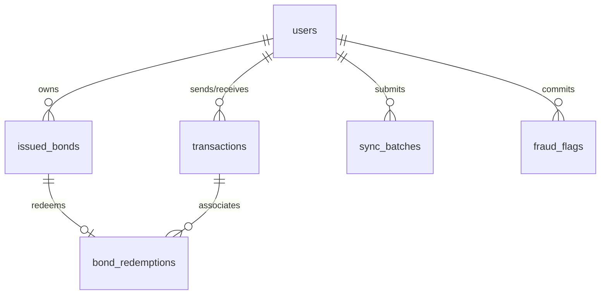

# BondPay — Consolidated Project Documentation
### Offline Bond-Based Payment System
**Stack: React Native (Expo) + Node.js (Express) | Version: 1.0.0 (NCIT TechFest 3.0 MVP & Production Roadmap)**

---

## 1. Executive Summary

BondPay is an offline-capable digital payment system designed for regions with unreliable internet connectivity (such as rural trekking routes or geographically isolated communities in Nepal) or scenarios where mobile data is prohibitively expensive for micro-transactions. 

Traditional digital e-wallets operate on account-based synchronous models, requiring constant internet access to deduct balance from the sender and credit it to the receiver. BondPay shifts this paradigm to a **token-based model**, treating digital money as discrete, cryptographically signed objects called **"Bonds"** (analogous to physical banknotes). 

Users allocate a portion of their online balance to create offline bonds while connected to the internet. These bonds can then be transferred peer-to-peer face-to-face via optical QR codes, completely offline. The mathematical authenticity of the bonds and transaction authorization is verified offline by the receiver using asymmetric cryptographic signatures (Ed25519), while double-spending and ledger settlement are resolved when either party reconnects and syncs with the central server.

---

## 2. Problem Statement & The BondPay Solution

### 2.1 The Nepal Infrastructure Challenge
1. **Remote Trekking Routes & Tourist Zones**: Trails like the Annapurna Circuit, Everest Base Camp, or Upper Mustang pass through zones where mobile networks are absent, or restricted to unstable 2G connections. Tourists and locals hold digital funds (in eSewa, Khalti, or bank apps) but are forced to carry physical cash.
2. **Data Cost vs. Micro-Transaction Value**: Initiating a mobile data connection to pay Rs.20 for tea is financially impractical when cellular data fees cost a significant fraction of the transaction itself.
3. **Intermittent Connectivity**: Rural shops and lodges may only obtain signal for a few hours a day or at specific spots, rendering synchronous transactions impossible.

### 2.2 Why Existing E-Wallets Fail Offline
Traditional wallets rely on database records stored exclusively in the cloud. They lack a local cryptographically verifiable representation of value. Therefore:
- The sender cannot prove they have the funds.
- The receiver cannot verify that the sender’s balance was decremented.
- There is no mechanism to authorize transfers without real-time connection.

### 2.3 The BondPay Proposition: Digital Banknotes
BondPay models digital money as physical cash using modern cryptography:
- **Server as the Central Bank**: The server signs and issues bonds using its private key, acting as an unforgeable digital watermark.
- **Offline Asymmetric Verification**: Devices use the server's public key (hardcoded) to verify bonds, and the sender's public key to verify transaction authorization completely offline.
- **Bounded Fraud Window**: The system accepts a limited risk window (like EMV card offline floor limits) rather than pretending double-spending can be prevented offline, resolving duplicates post-sync and enforcing velocity limits (3000 NPR cap).

---

## 3. System Architecture & Component Map

The BondPay ecosystem consists of:
1. **React Native (Expo) Mobile App**: Operates the offline wallet, camera/QR scanner, local SQLite ledger, and cryptographic engine.
2. **Node.js (Express.js) Backend**: Serves as the central clearing house, verifying signatures, handling sync operations, and managing Supabase PostgreSQL.
3. **Supabase (PostgreSQL) Database**: Authoritative cloud database storing user accounts, issued bonds, redemptions, and audit logs.
4. **BondPay Station (ESP8266 Hardware Terminal)**: A standalone physical terminal for offline card/RFID verification in merchant environments.

```
┌────────────────────────────────────────────────────────────────────────┐
│                              REACT NATIVE CLIENT                       │
│                                                                        │
│   ┌───────────────┐     ┌───────────────┐      ┌──────────────────┐    │
│   │   UI Layer    │     │  Crypto Layer │      │   Storage Layer  │    │
│   │ (Screens, Tab │     │ (Ed25519,     │      │ (SQLite: bonds,  │    │
│   │  Navigation)  │     │  SecureStore) │      │  txns, metadata) │    │
│   └───────────────┘     └───────────────┘      └──────────────────┘    │
│                                                                        │
│   ┌───────────────┐     ┌───────────────┐                              │
│   │   QR Layer    │     │  Sync Service │                              │
│   │  (Multi-QR)   │     │   (Axios)     │                              │
│   └───────────────┘     └───────────────┘                              │
└───────────────────────────────┬────────────────────────────────────────┘
                                │
                  Internet (HTTP / HTTPS)
                                │
┌───────────────────────────────▼────────────────────────────────────────┐
│                            EXPRESS.JS SERVER                           │
│                                                                        │
│   ┌───────────────┐     ┌───────────────┐      ┌──────────────────┐    │
│   │   Auth API    │     │   Bond API    │      │  Transaction API │    │
│   │  (Bcrypt, JWT)│     │  (Issuance)   │      │ (Sync, Verify)   │    │
│   └───────────────┘     └───────────────┘      └──────────────────┘    │
│                                                                        │
│   ┌───────────────┐     ┌───────────────┐                              │
│   │  Fraud Engine │     │ Database Pool │                              │
│   │ (Double-Spend)│     │ (pg Driver)   │                              │
│   └───────────────┘     └───────────────┘                              │
└───────────────────────────────┬────────────────────────────────────────┘
                                │
                     ACID SQL Transactions
                                │
┌───────────────────────────────▼────────────────────────────────────────┐
│                          SUPABASE (POSTGRESQL)                         │
│                                                                        │
│   ┌───────────────┐  ┌───────────────┐  ┌──────────────────┐  ┌──────┐ │
│   │    users      │  │  issued_bonds │  │ bond_redemptions │  │txns  │ │
│   └───────────────┘  └───────────────┘  └──────────────────┘  └──────┘ │
│   ┌───────────────┐  ┌───────────────┐  ┌──────────────────┐  ┌──────┐ │
│   │  sync_batches │  │  fraud_flags  │  │ pending_pickups  │  │config│ │
│   └───────────────┘  └───────────────┘  └──────────────────┘  └──────┘ │
└────────────────────────────────────────────────────────────────────────┘
```

---

## 4. The 4 Transaction Modes (Connectivity Matrix)

BondPay adapts dynamically to the network status of both the sender and receiver.

```
                    RECEIVER
                 Online      Offline
              ┌───────────┬───────────┐
    S    Online│  MODE 1   │  MODE 2   │
    E         │  Instant  │  Pending  │
    N         │  Transfer │  Pickup   │
    D         ├───────────┼───────────┤
    R    Offline│  MODE 3   │  MODE 4   │
              │ Bond→Sync │ Deferred  │
              └───────────┴───────────┘
```

### 4.1 Mode 1: Online ↔ Online (Instant Transfer)
- **Condition**: Both sender and receiver are connected to the internet.
- **Workflow**: 
  1. Receiver generates a Request QR showing their ID, name, requested amount, and `mode: "online"`.
  2. Sender scans the QR, inputs or confirms the amount, and taps pay.
  3. Sender's app makes a synchronous request to `/wallet/transfer-online`.
  4. Server locks both users' rows (`SELECT ... FOR UPDATE`), deducts the sender's `online_balance`, increases the receiver's `online_balance`, and creates a transaction record (`P2P_ONLINE`).
  5. Both devices receive real-time HTTP confirmations.
- **Balances Affected**: Sender Online Balance decreases; Receiver Online Balance increases. Offline balances remain unchanged.

### 4.2 Mode 2: Online → Offline (Pending Pickup)
- **Condition**: Sender is online; receiver is offline or unavailable.
- **Workflow**:
  1. Sender initiates payment via `/wallet/transfer-pending` providing the receiver's ID and amount.
  2. Server deducts the amount from the sender's online balance and generates a `pending_pickup` record containing a unique 6-character pickup code and an Ed25519 signature from the server.
  3. Sender's screen displays a Pickup QR.
  4. Receiver scans the QR offline, verifying the server's signature locally to confirm the sender completed their step.
  5. The receiver stores the transaction locally with status `pending_pickup`.
  6. Once the receiver comes online, their background sync service sends a `POST /wallet/claim-pending` request. The server verifies the pickup and credits the receiver's online balance.
  7. **Safety**: Pickups automatically expire in 48 hours. If unclaimed, the server refunds the sender.

### 4.3 Mode 3: Offline → Online (Bond Transfer + Immediate Sync)
- **Condition**: Sender is offline (using bonds); receiver is online.
- **Workflow**:
  1. Receiver generates a Request QR (`mode: "offline"`).
  2. Sender scans the QR, selects available local offline bonds matching the amount, hashes the transaction payload, and signs it using their private key. The app displays the Payment QR.
  3. Receiver scans the Payment QR, verifying the server's signature on the bonds and the sender's signature on the transaction offline.
  4. Because the receiver is online, the app immediately forwards the payload to `/transactions/sync`.
  5. The server redeems the bonds, credits the receiver's online balance, and confirms the transaction.
- **Balances Affected**: Sender Offline Balance decreases; Receiver Online Balance increases immediately.

### 4.4 Mode 4: Offline → Offline (Bond Transfer + Deferred Sync)
- **Condition**: Both sender and receiver are offline.
- **Workflow**:
  1. Receiver generates a Request QR (`mode: "offline"`).
  2. Sender scans, selects bonds, signs the transaction, and displays a Payment QR (using the multi-QR animated carousel if necessary).
  3. Receiver scans and validates the cryptographic signatures offline.
  4. Receiver's app saves the transaction to SQLite as `pending_sync`, and marks the incoming bonds as `received_pending_sync`.
  5. Senders mark their sent bonds as `spent` locally.
  6. **Settlement**: When *either* party regains internet connection, their app syncs with `/transactions/sync`. The server processes the sync batch, finalizes the balance adjustments, and updates the transaction logs.

---

## 5. Cryptographic Foundations & Handshake Protocol

Security is implemented at the application layer, ensuring data integrity, non-repudiation, and authenticity without transport-level security (TLS) or real-time central validation.

### 5.1 Asymmetric Signature Algorithm: Ed25519
BondPay utilizes the Ed25519 elliptic curve digital signature algorithm over RSA-2048 and ECDSA P-256 due to:
- **Compact Signature Size**: A deterministic 64-byte signature and a 32-byte public key prevent QR code bloat.
- **High Performance**: Rapid execution on mobile JavaScript engines.
- **Side-Channel Resistance**: Immune to timing attacks.

### 5.2 Key Management
1. **Server Keys**: The server has a single Ed25519 key pair. The private key remains secure in server environment variables. The public key is hardcoded into the mobile app and used to verify the authenticity of bonds.
2. **User Keys**: Every user generates an Ed25519 key pair on registration:
   - **Private Key**: Saved in `expo-secure-store` using device hardware security (Android Keystore / Apple Secure Enclave). Raw bytes cannot be extracted.
   - **Public Key**: Uploaded to the database during signup to verify that user's signatures during sync.

### 5.3 SHA-256 Hashing & Payload Binding
Before signing, JSON strings are structured, sorted, and hashed using SHA-256. 

To prevent **Bond Swapping Attacks** (where an attacker intercepts a signed transaction and swaps out the bonds), the transaction signature payload explicitly binds the specific bond IDs being spent.

```
bondIdsString = concatenateSorted(transaction.bondIds)
txPayload = txId + senderId + receiverId + totalAmount + timestamp + nonce + bondIdsString + message
txHash = SHA256(txPayload)
txSignature = Ed25519_Sign(txHash, senderPrivateKey)
```

```
bondPayload = bondId + value + ownerId + issuedAt + expiresAt + serverKeyVersion
bondHash = SHA256(bondPayload)
bondSignature = Ed25519_Sign(bondHash, serverPrivateKey)
```

### 5.4 Replay Protection
Every transaction payload includes a cryptographically secure 128-bit random hex `nonce` generated fresh:
```typescript
// In React Native:
const nonce = Crypto.getRandomBytes(16).map(b => b.toString(16).padStart(2, '0')).join('');
```
Since the `txId` is derived from hashing the payload (including `nonce` and `timestamp`), the transaction ID is unique. If an attacker replays the QR code, the receiver's SQLite DB rejects the duplicate `txId`, and the server rejects it via the `bond_redemptions` unique primary key constraint.

---

## 6. Mathematical Algorithms & Local Logic

### 6.1 Greedy Denomination Breakdown (Issuance)
When a user loads NPR $X$ online balance to offline bonds, the server divides it into optimal denominations to facilitate exact-change spending. 

Available denominations (in paisa): `[1000, 500, 100, 50, 20, 10, 5]` (equivalent to NPR 10, 5, 1, 0.50, 0.20, 0.10, 0.05).

**Algorithm**:
```
INPUT: amount, userId
IF amount % 5 != 0 THEN RETURN error
IF amount > 3000 THEN RETURN error (Limit exceeded)

bonds = []
remaining = amount

// If amount is high, enforce mixed denominations for change flexibility
IF amount > 100 THEN
   // Pre-allocate a starter pack of smaller denominations
   starter = [100, 100, 50, 50, 20, 20, 10, 10, 5, 5] // 370 paisa (Rs. 3.7)
   FOR each val IN starter:
      IF remaining >= val THEN
         bonds.push(createBond(val, userId))
         remaining -= val

// Greedy allocation for remaining amount
denominations = [1000, 500, 100, 50, 20, 10, 5]
FOR each denom IN denominations:
   while remaining >= denom:
      bonds.push(createBond(denom, userId))
      remaining -= denom

RETURN bonds
```

### 6.2 Subset-Sum exact Change Algorithm (Spending)
When an offline sender receives a payment request of amount $T$, the app runs a memoized subset-sum algorithm over their local `available` bonds to find an exact combination.

```
INPUT: availableBonds (array of {bondId, value}), targetAmount
OUTPUT: subset (array of bondIds summing exactly to targetAmount)

Initialize DP array of size (targetAmount + 1) with null
DP[0] = []

FOR each bond IN availableBonds:
   FOR w FROM targetAmount DOWNTO bond.value:
      IF DP[w - bond.value] is not null AND DP[w] is null THEN
         DP[w] = DP[w - bond.value] + [bond]

IF DP[targetAmount] is null:
   // Exact change cannot be made.
   // Prompt user with closest possible amounts based on their bills.
   RETURN closestMatchSuggestor(availableBonds, targetAmount)
ELSE:
   RETURN DP[targetAmount]
```

### 6.3 Synchronous Ledger Concurrency Protection
To prevent race conditions during synchronous wallet operations (like online peer-to-peer transfers), the Node.js API utilizes PostgreSQL row-level locks. This prevents double-deductions during rapid concurrent transactions.

```sql
-- Transaction begins
BEGIN;

-- Lock sender and receiver rows immediately
SELECT online_balance FROM users WHERE user_id = sender_id FOR UPDATE;
SELECT online_balance FROM users WHERE user_id = receiver_id FOR UPDATE;

-- Perform balances updates
UPDATE users SET online_balance = online_balance - amount WHERE user_id = sender_id;
UPDATE users SET online_balance = online_balance + amount WHERE user_id = receiver_id;

-- Log transaction and commit
INSERT INTO transactions ...;
COMMIT;
```

---

## 7. Solutions to Key Challenges

### 7.1 Stolen or Broken Phones (Recovery)
- **Challenge**: The user’s device holds their private key. If the phone is broken or stolen, their offline bonds (up to 3000 NPR) cannot be retrieved directly from the device.
- **Solution 1: Single Active Device (Force Login)**: A user is only permitted one active session. When they log in to a new device:
  1. The server checks the `active_device_id`. If different, it prompts a **Force Login**.
  2. Executing a Force Login calls the server to automatically revoke all issued bonds assigned to the user (`status = 'revoked'`) in `issued_bonds`.
  3. The server credits the total value of those revoked bonds back to the user’s `online_balance`.
  4. The old device's session is invalidated on the server.
- **Solution 2: Bond Expiry (TTL)**: What if a thief steals the phone and spends the bonds offline before the user logs in to a new device?
  - Every bond carries an `expires_at` timestamp. Users can set their bond TTL from **1 hour to 5 days**. 
  - Spent offline transactions using expired bonds will be rejected by the server during sync. 
  - To authorize *any* offline send, the app enforces **Biometric Authentication** (Fingerprint/FaceID or device PIN), preventing unauthorized use of the offline bonds.

### 7.2 The A → B → C Offline Chain (Double-Spend prevention)
- **Challenge**: If A (offline) sends 500 NPR to B (offline), and B (offline) immediately spends that same 500 NPR to C (offline), B could double-spend. If A syncs first, the server credits B's online balance. If B then spends the same bond to C, C's sync will fail because the bond was already redeemed.
- **Solution: Direct-to-Online Balance Model**:
  - Received offline bonds are saved in the receiver's SQLite DB with status `received_pending_sync`.
  - These received bonds are displayed as **Pending Online Balance** (Orange UI).
  - Crucially, **the app blocks users from spending bonds marked `received_pending_sync` offline**. They can only spend bonds marked `available` (which were loaded directly from their own online balance).
  - Once the receiver goes online and syncs, the pending bonds are redeemed on the server and converted to **Actual Online Balance** (Green UI), where they can then be loaded as fresh bonds if needed. This eliminates A→B→C cascading offline double-spends.

### 7.3 Large QR Payload Size (Animated Multi-QR Carousel)
- **Challenge**: A transaction with several bonds, signatures, and public keys exceeds 2000 characters. Scanning this as a single dense QR code fails on low-quality smartphone cameras.
- **Solution: Animated QR Carousel**:
  - The payload is compressed using deflate, Base64-encoded, and split into small chunks of **~300 characters** each.
  - Chunks are wrapped in a metadata envelope and displayed as an animated sequence (carousel) changing at **3 Hz** (333ms per frame).
  - The scanning device runs a frame accumulator, building the payload as it captures different frames, rendering a visual progress bar. Once all frames are collected, it de-segments and verifies the payload checksum.

**QR Chunk Envelope Structure**:
```json
{
  "v": 1,
  "sid": "A3F1B2",
  "i": 2,
  "t": 6,
  "d": "aGFzaC1kYXRhLXNlZ21lbnQ...",
  "cs": "4e7a89b1"
}
```

---

## 8. Data Structures (JSON Specifications)

### 8.1 BondToken
```json
{
  "bondId": "BOND-550e8400-e29b-41d4-a716-446655440000",
  "value": 500,
  "ownerId": "73c683b6-9bb2-4113-bf7b-9cfb5a3bb401",
  "issuedAt": 1782542400,
  "expiresAt": 1785134400,
  "issuedByServer": "base64-server-public-key",
  "serverSignature": "base64-ed25519-signature-64-bytes"
}
```

### 8.2 Transaction
```json
{
  "txId": "TX-a7f3b2d91c8e4f62",
  "bonds": [
    { "bondId": "BOND-550e8400-e29b-41d4-a716-446655440000", "value": 500 }
  ],
  "senderId": "48f10b77-382a-43c3-9828-e4b2e88a0e88",
  "receiverId": "73c683b6-9bb2-4113-bf7b-9cfb5a3bb401",
  "totalAmount": 500,
  "timestamp": 1782543600,
  "nonce": "c9284fa9e38d7211",
  "senderPublicKey": "base64-sender-public-key-32-bytes",
  "senderSignature": "base64-sender-signature-64-bytes",
  "message": "Payment for tea"
}
```

### 8.3 ReceiverQR (Payment Request)
```json
{
  "type": "BONDPAY_REQUEST",
  "version": "1.0",
  "receiverId": "73c683b6-9bb2-4113-bf7b-9cfb5a3bb401",
  "receiverName": "Kshitiz Bhatta",
  "requestedAmount": 500,
  "requestNonce": "f908e2a1b938f4a7",
  "timestamp": 1782543580,
  "expiresAt": 1782543880
}
```

### 8.4 PaymentQR (Full Transfer Package)
```json
{
  "type": "BONDPAY_PAYMENT",
  "version": "1.0",
  "transaction": {
    "txId": "TX-a7f3b2d91c8e4f62",
    "senderId": "48f10b77-382a-43c3-9828-e4b2e88a0e88",
    "receiverId": "73c683b6-9bb2-4113-bf7b-9cfb5a3bb401",
    "totalAmount": 500,
    "timestamp": 1782543600,
    "nonce": "c9284fa9e38d7211",
    "senderPublicKey": "base64-sender-public-key-32-bytes",
    "senderSignature": "base64-sender-signature-64-bytes",
    "message": "Payment for tea"
  },
  "bonds": [
    {
      "bondId": "BOND-550e8400-e29b-41d4-a716-446655440000",
      "value": 500,
      "ownerId": "48f10b77-382a-43c3-9828-e4b2e88a0e88",
      "issuedAt": 1782542400,
      "expiresAt": 1785134400,
      "issuedByServer": "base64-server-public-key",
      "serverSignature": "base64-ed25519-signature"
    }
  ]
}
```

### 8.5 SyncBatch
```json
{
  "batchId": "sync-batch-uuid",
  "incoming": [
    {
      "transaction": { "txId": "TX-..." },
      "bonds": [{ "bondId": "BOND-..." }]
    }
  ],
  "outgoing": []
}
```

---

## 9. Database Architecture & Schemas

### 9.1 Server-Side Supabase (PostgreSQL)



#### 1. `users` Table
| Column | Type | Constraints | Description |
|--------|------|-------------|-------------|
| `user_id` | UUID | PK, DEFAULT gen_random_uuid() | Unique user ID |
| `phone_number` | TEXT | UNIQUE NOT NULL | Verified mobile number |
| `email` | TEXT | UNIQUE NOT NULL | Email address |
| `full_name` | TEXT | NOT NULL | Display name |
| `password_hash` | TEXT | NOT NULL | bcrypt hash |
| `public_key` | TEXT | Nullable | Base64 Ed25519 public key |
| `online_balance` | BIGINT | NOT NULL DEFAULT 0 | Balance in paisa (1 NPR = 100 paisa) |
| `is_frozen` | BOOLEAN | NOT NULL DEFAULT false | Freeze account flag |
| `registered_at` | TIMESTAMPTZ | NOT NULL DEFAULT NOW() | Registration date |
| `active_device_id` | TEXT | Nullable | Currently logged-in device identifier |
| `ttl_hours` | INTEGER | DEFAULT 72 | User configurable bond TTL in hours |

#### 2. `issued_bonds` Table
| Column | Type | Constraints | Description |
|--------|------|-------------|-------------|
| `bond_id` | TEXT | PK | Format: `BOND-<uuid>` |
| `value` | BIGINT | NOT NULL | Face value in paisa |
| `owner_id` | UUID | FK → `users`, CASCADE | Current owner of the bond |
| `issued_at` | TIMESTAMPTZ | NOT NULL | Date minted |
| `expires_at` | TIMESTAMPTZ | NOT NULL | Expiry date |
| `server_key_version`| TEXT | NOT NULL | Identifies server key version used |
| `server_signature` | TEXT | NOT NULL | Ed25519 signature over bond payload |
| `status` | TEXT | NOT NULL DEFAULT 'active' | `'active' | 'redeemed' | 'expired' | 'revoked'` |

#### 3. `pending_pickups` Table
| Column | Type | Constraints | Description |
|--------|------|-------------|-------------|
| `pickup_id` | TEXT | PK | Format: `PICKUP-<uuid>` |
| `sender_id` | UUID | FK → `users` | Sender who put up balance |
| `receiver_id` | UUID | FK → `users` | Intended receiver |
| `amount` | BIGINT | NOT NULL | Value in paisa |
| `pickup_code` | TEXT | UNIQUE NOT NULL | 6-char hex pickup verification code |
| `server_sig` | TEXT | NOT NULL | Server signature over pickup details |
| `status` | TEXT | DEFAULT 'pending' | `'pending' | 'claimed' | 'expired'` |
| `created_at` | TIMESTAMPTZ | DEFAULT NOW() | Creation date |
| `expires_at` | TIMESTAMPTZ | NOT NULL | Expiration date (48h max) |
| `claimed_at` | TIMESTAMPTZ | Nullable | Claim date |

#### 4. `bond_redemptions` Table
| Column | Type | Constraints | Description |
|--------|------|-------------|-------------|
| `bond_id` | TEXT | PK, FK → `issued_bonds` | Unique bond ID (forces single redemption) |
| `tx_id` | TEXT | NOT NULL | Transaction redeeming this bond |
| `redeemed_by` | UUID | FK → `users` | Receiver user ID |
| `redeemed_from` | UUID | FK → `users` | Sender user ID |
| `redeemed_at` | TIMESTAMPTZ | DEFAULT NOW() | Time of sync resolution |
| `batch_id` | TEXT | NOT NULL | Submitting sync batch ID |

#### 5. `transactions` Table
| Column | Type | Constraints | Description |
|--------|------|-------------|-------------|
| `tx_id` | TEXT | PK | Format varies by mode |
| `tx_type` | TEXT | NOT NULL DEFAULT 'P2P_OFFLINE' | `'P2P_OFFLINE' | 'P2P_ONLINE' | 'BOND_LOAD' | 'BOND_REVERSE' | 'TOPUP'` |
| `sender_id` | UUID | FK → `users`, SET NULL | Sender account |
| `receiver_id` | UUID | FK → `users`, SET NULL | Receiver account |
| `total_amount` | BIGINT | NOT NULL | Net sum in paisa |
| `tx_timestamp` | TIMESTAMPTZ | NOT NULL | Transaction execution time |
| `nonce` | TEXT | Nullable | Cryptographic unique nonce |
| `sender_signature` | TEXT | Nullable | Sender transaction signature |
| `message` | TEXT | Nullable | Transaction description note |
| `is_offline` | BOOLEAN | NOT NULL DEFAULT false | Offline status indicator |
| `status` | TEXT | DEFAULT 'accepted' | `'accepted' | 'pending' | 'failed' | 'flagged'` |
| `synced_at` | TIMESTAMPTZ | DEFAULT NOW() | Server processing time |

#### 6. `fraud_flags` Table
| Column | Type | Constraints | Description |
|--------|------|-------------|-------------|
| `flag_id` | UUID | PK, DEFAULT gen_random_uuid() | Flag unique ID |
| `user_id` | UUID | FK → `users`, CASCADE | User committing the suspected fraud |
| `tx_id` | TEXT | Nullable | Transaction record ID |
| `bond_id` | TEXT | Nullable | Bond record ID |
| `flag_type` | TEXT | NOT NULL | `'DOUBLE_SPEND' | 'VELOCITY' | 'REVIEW'` |
| `severity` | TEXT | NOT NULL | `'LOW' | 'MEDIUM' | 'HIGH' | 'CRITICAL'` |
| `details` | JSONB | Nullable | Detailed JSON audit parameters |
| `created_at` | TIMESTAMPTZ | DEFAULT NOW() | Flag logging time |
| `resolved_at` | TIMESTAMPTZ | Nullable | Flag clearance time |

#### 7. `sync_batches` Table
| Column | Type | Constraints | Description |
|--------|------|-------------|-------------|
| `batch_id` | TEXT | PK | Unique sync batch identifier (UUID) |
| `user_id` | UUID | FK → `users`, CASCADE | Syncing user |
| `submitted_at` | TIMESTAMPTZ | NOT NULL | Client transmission timestamp |
| `processed_at` | TIMESTAMPTZ | Nullable | Server processing completion time |
| `result` | JSONB | Nullable | Processed response summary cache (idempotency) |

#### 8. `system_config` Table
| Column | Type | Constraints | Description |
|--------|------|-------------|-------------|
| `config_key` | TEXT | PK | Setting unique key |
| `config_value` | TEXT | NOT NULL | Configuration values |
| `description` | TEXT | Nullable | Setting explanation |
| `updated_at` | TIMESTAMPTZ | DEFAULT NOW() | Configuration change date |

---

### 9.2 Client-Side Mobile Ledger (SQLite)

#### 1. `bonds` Table
| Column | Type | Description |
|--------|------|-------------|
| `bond_id` | TEXT PK | Format: `BOND-<uuid>` |
| `value` | INTEGER NOT NULL | Value in paisa |
| `owner_id` | TEXT NOT NULL | Current owner user ID |
| `issued_at` | INTEGER NOT NULL | Mint Unix timestamp |
| `expires_at` | INTEGER NOT NULL | Expiry Unix timestamp |
| `issued_by_server` | TEXT NOT NULL | Server public key |
| `server_signature` | TEXT NOT NULL | Ed25519 server signature |
| `status` | TEXT DEFAULT 'available' | `'available' | 'spent' | 'received_pending_sync'` |
| `local_tx_id` | TEXT | FK to local transaction |
| `received_at` | INTEGER | Time of offline transfer receipt |
| `created_at` | INTEGER | Local entry logging date |

#### 2. `transactions` Table
| Column | Type | Description |
|--------|------|-------------|
| `tx_id` | TEXT PK | Unique transaction hash ID |
| `sender_id` | TEXT NOT NULL | Sender user ID |
| `receiver_id` | TEXT NOT NULL | Receiver user ID |
| `total_amount` | INTEGER NOT NULL | Total transferred sum in paisa |
| `timestamp` | INTEGER NOT NULL | Unix execution timestamp |
| `nonce` | TEXT NOT NULL | 128-bit transaction nonce |
| `sender_public_key` | TEXT NOT NULL | Sender's Ed25519 public key |
| `sender_signature` | TEXT NOT NULL | Sender's transaction authorization |
| `role` | TEXT NOT NULL | `'sender' | 'receiver'` |
| `sync_status` | TEXT DEFAULT 'pending' | `'pending' | 'pending_pickup' | 'synced' | 'failed' | 'flagged'` |
| `synced_at` | INTEGER | Server settlement date |
| `rejection_reason` | TEXT | Error text if rejected by server |
| `message` | TEXT | Transaction note description |
| `created_at` | INTEGER | Local entry logging date |

#### 3. `transaction_bonds` Table
| Column | Type | Description |
|--------|------|-------------|
| `tx_id` | TEXT | FK to `transactions.tx_id` |
| `bond_id` | TEXT | FK to `bonds.bond_id` |
| `direction` | TEXT | `'outgoing' | 'incoming'` |
| PRIMARY KEY | (tx_id, bond_id) | Composite Key |

---

## 10. API Reference

All authenticated APIs require:
`Authorization: Bearer <jwt_token>`

### 10.1 Authentication & Profile
- **`POST /auth/register`**: Register a new user profile.
  - *Payload*: `{ phoneNumber, email, fullName, password, publicKey?, deviceId? }`
  - *Response (201)*: `{ userId, jwt, expiresAt }`
- **`POST /auth/login`**: Authenticate using phone/email.
  - *Payload*: `{ loginId, password, deviceId?, forceLogin? }`
  - *Response (200)*: `{ userId, fullName, publicKey, jwt, onlineBalance, expiresAt }`
  - *Response (409)*: `{ requiresForceLogin: true, message: "Logged in on another device." }`
- **`POST /auth/public-key`**: Register the local client public key.
  - *Payload*: `{ publicKey }`
- **`GET /auth/me`**: Get user profile status and online balance.

### 10.2 Bond Management
- **`POST /bonds/issue`**: Issue offline bonds from online balance.
  - *Payload*: `{ totalAmount }` (NPR)
  - *Response (200)*: `{ bonds: [ BondToken ], newOnlineBalance }`
- **`GET /bonds/active`**: Fetches all server-side active bonds owned by the user.

### 10.3 Wallet Ledger
- **`POST /wallet/topup`**: Mock deposit to online balance.
  - *Payload*: `{ amount }` (NPR)
- **`POST /wallet/transfer-online`**: Online Mode 1 instant transfer.
  - *Payload*: `{ receiverId, amount }`
- **`POST /wallet/transfer-pending`**: Online Mode 2 pickup creation.
  - *Payload*: `{ receiverId, amount }`
  - *Response (200)*: `{ pickupId, pickupCode, serverSig, expiresAt }`
- **`POST /wallet/claim-pending`**: Claim a pending pickup when online.
  - *Payload*: `{ pickupId }`
- **`POST /wallet/reverse-bond`**: Revoke offline bonds and credit online balance.
  - *Payload*: `{ bondIds: [] }`
- **`GET /wallet/history`**: Get remote database transactions list.

### 10.4 Transaction Sync
- **`POST /transactions/sync`**: Synchronize offline transactions.
  - *Payload*: `{ batchId, incoming: [ { transaction, bonds } ], outgoing: [] }`
  - *Response (200)*: `{ accepted: [ txIds ], rejected: [], flagged: [], updatedOnlineBalance }`

### 10.5 Admin API Console (Credentials: `admin/admin`)
- **`GET /admin/api/stats`**: Get system overview totals.
- **`GET/POST/PUT/DELETE /admin/api/users`**: Manage users.
- **`GET/POST/PUT/DELETE /admin/api/bonds`**: Manage bonds.
- **`GET/POST/PUT/DELETE /admin/api/transactions`**: View transaction history.
- **`GET/PUT /admin/api/configs`**: Modify system configuration variables.

---

## 11. Frontend Services

### 11.1 SyncService (`sync.service.ts`)
Controls sync execution. Uses an execution mutex (`isSyncing`) to block concurrent threads.
- Queries SQLite `transactions` where `sync_status` is `pending`.
- Compiles the transactions and associated SQLite `bonds` into a `SyncBatch`.
- Post to `/transactions/sync`.
- If accepted: marks SQLite `transactions` as `synced` and deletes SQLite spent bonds from the local device to clear memory.
- If flagged/rejected: records the rejection errors in SQLite transactions.

### 11.2 CryptoService (`crypto.service.ts`)
Manages cryptographic functions.
- `generateTempKeys()` / `initializeUserKeys(userId)`: Handles key creation. Stores private keys in `expo-secure-store`.
- `signTransaction(dataString, userId)`: Fetches private key from `expo-secure-store` and signs using Ed25519 algorithm.
- `verifyServerBondSignature(...)` / `verifySenderSignature(...)`: Offline mathematical validations using public keys.

### 11.3 MultiQRService (`multiqr.service.ts`)
Provides animated QR frame segmentation.
- `encode(payloadString, chunkSize)`: Compresses the payload via zlib deflate, Base64 encodes, segments into chunks of size `chunkSize`, and attaches session headers.
- `createAccumulator(onComplete)`: Instantiates a capture map checking chunk sequences and DJB2 checksums, returning a progress callback.

---

## 12. BondPay Station: Hardware Terminal

The **BondPay Station** is a physical RFID/NFC terminal designed for offline merchant checkout.

```
       ┌────────────────────────┐
       │   ESP8266 MCU (NodeMCU)│
       │                        │
       │   D5 (SCK) ── D6 (MISO)│
       │   D7 (MOSI) ── D8 (SDA)│
       │   D3 (RST)   D2 (SDA)  │
       │   D1 (SCL)             │
       │   D4 (G_LED) D0 (R_LED)│
       │   RX (BUZZER)          │
       └────────────────────────┘
```

### 12.1 Material Components
- **ESP8266 Microcontroller** (NodeMCU V3)
- **MFRC522 RFID Reader**
- **16x2 LCD Character Display** (integrated I2C backpack)
- **Active Piezo Buzzer**
- **LEDs** (Green success, Red failure) + $220\Omega$ current-limiting resistors

### 12.2 Pin Configurations
| ESP8266 Pin | Component Pin | Connection Description |
|-------------|---------------|------------------------|
| **3.3V**    | MFRC522 3.3V  | Reader power supply. **DO NOT CONNECT TO 5V** |
| **GND**     | MFRC522 GND   | Common ground connection |
| **D3**      | MFRC522 RST   | Reset pin control |
| **D6**      | MFRC522 MISO  | SPI Master In Slave Out |
| **D7**      | MFRC522 MOSI  | SPI Master Out Slave In |
| **D5**      | MFRC522 SCK   | SPI Clock |
| **D8**      | MFRC522 SDA   | SPI Slave Select |
| **VU / 5V** | LCD I2C VCC   | 5V LCD logic board power |
| **GND**     | LCD I2C GND   | Ground connection |
| **D2**      | LCD I2C SDA   | I2C Data bus |
| **D1**      | LCD I2C SCL   | I2C Clock bus |
| **D4**      | Green LED (+) | Success indicator (resistor in series) |
| **D0**      | Red LED (+)   | Failure indicator (resistor in series) |
| **RX / SD2**| Buzzer (+)    | Sound alert trigger |

### 12.3 Operations & LCD Diagnostics
1. **Boot**: Double beep. LCD shows:
   ```
   BondPay Station
   Ready (IP:192.168.4.1)
   ```
2. **Dashboard Access**: Connect device WiFi to SSID: `BondPay Station` (Password: `bondpay123`). Navigate browser to `http://192.168.4.1`.
3. **Card Registration**: Click "Register New Card" on dashboard, input customer name, scan card to fetch UUID, input balance, and save.
4. **Merchant Payment**: Input NPR amount on Web Dashboard and click "Start Payment". Terminal shows:
   ```
   Payment Mode
   Amount: NPR 150
   ```
   Customer scans their physical RFID card. 
   - *Success*: Green LED, double beep, LCD displays remaining balance.
   - *Failure*: Red LED, long beep, LCD shows "Insuff. Balance" or "Unregistered Card".

### 12.4 Compiling & Flashing
1. **Arduino IDE Settings**: Add ESP8266 stable JSON URL to boards manager settings. Install `esp8266` board library.
2. **Required Libraries**:
   - `MFRC522` by GithubCommunity
   - `LiquidCrystal I2C` by Frank de Brabander
   - `ArduinoJson` (v6.x or v7.x)
   - `ESPAsyncTCP` and `ESPAsyncWebServer` (manual ZIP installations)
3. **FS Settings**: Install LittleFS tool plugin in Arduino IDE. Set Board to **NodeMCU 1.0 (ESP-12E)**. Select flash size: **4MB (FS: 2MB)**.
4. **Flashing**: Open `BondPay_Terminal.ino`, compile, and click Upload.
5. **Dashboard Upload**: With Serial Monitor closed, click **Tools → ESP8266 LittleFS Data Upload** to flash LittleFS files (`index.html`, `styles.css`, `app.js`) to the flash filesystem.

---

## 13. Threat Model & Security Threat Matrix

| ID | Threat Vector | Severity | Mitigation Strategy |
|----|---------------|----------|---------------------|
| **T1** | **Counterfeit Bonds** (Attacker mints fake bond tokens) | **HIGH** | Every bond contains a server Ed25519 signature. Receiver verifies this signature offline using the server's public key. Fake bonds are rejected offline. |
| **T2** | **Bond Value Tampering** (Attacker alters bond denomination) | **HIGH** | The server signature covers the value field (`bondId + value...`). Changing the value invalidates the signature. |
| **T3** | **Replay Attacks** (Intercepting and reusing a payment QR) | **MEDIUM**| Every transaction has a 128-bit random `nonce` and a `timestamp`. Replays are rejected by unique key constraints in local SQLite and server PostgreSQL. |
| **T4** | **Signature Forgery** (Attacker signs transactions as another user) | **HIGH** | User private keys are isolated in Android Keystore / Apple Secure Enclave. Transactions are signed using Ed25519 with SHA-256 pre-hashing, which has a 128-bit security level. |
| **T5** | **Man-in-the-Middle (MitM)** (Network interception of transactions) | **MEDIUM**| Transaction payloads are transferred directly between devices via optical QR codes. There is no active network interface to intercept. |
| **T6** | **Private Key Extraction** (Attacker reads private key from local files) | **HIGH** | Private keys are stored in secure storage (`expo-secure-store`) using hardware-level key isolation. Keys cannot be read, even on rooted devices. |
| **T7** | **Race Conditions (TOCTOU)** (Exploiting timing gaps to double-spend online) | **MEDIUM**| Server uses PostgreSQL `SELECT ... FOR UPDATE` pessimistic locks during transfers to queue concurrent transactions. |
| **T8** | **Expired Bonds Spend** (Attacker attempts to spend old bonds) | **LOW** | Expired bonds are rejected during local verification, and the server verifies `expires_at` during synchronization. |
| **T9** | **Sync Batch Replay** (Attacker resubmits processed sync batch) | **MEDIUM**| Sync batches use unique `batchId` keys. The server caches sync results in `sync_batches` to ensure idempotency. |
| **T10**| **Offline Double-Spending** (Attacker spends same bond to multiple offline users) | **HIGH** | Verified during server synchronization. The first redemption succeeds; subsequent syncs throw constraint violations on `bond_redemptions`. The double-spending user is flagged (`DOUBLE_SPEND` in `fraud_flags` table) and penalised (account frozen, velocity limit of 3000 NPR, legal terms). |

---

## 14. Known Limitations & Production Roadmap

1. **Offline Double-Spending Window**: Offline double-spending cannot be prevented at the protocol level without internet connectivity. Mitigated by a 3000 NPR balance cap, user-configurable TTL, biometric auth requirements, and automated account suspension upon detection.
2. **NRB Compliance**: Currently designed as a hackathon prototype, requiring integration with Nepal Rastra Bank (NRB) regulations, banking APIs, and formal KYC validation for production use.
3. **Hardcoded API URLs**: Local and production API URLs are hardcoded in source files. Future releases should implement automated build profiles (e.g., using `react-native-config` or `.env` files).
4. **Admin Credentials**: The admin console credentials are hardcoded (`admin/admin`). Must be replaced with secure database hashes and role-based access control (RBAC).
5. **No Offline Change-Making**: The sender must have the exact combination of bonds to pay. If they only have a Rs. 500 bond and need to pay Rs. 200, the transaction cannot be completed offline. Users must load a diverse set of bond denominations to ensure flexibility.

---

## 15. Local Setup & Deployment Guide

### 15.1 Backend Setup
1. Clone the project and navigate to the server folder:
   ```bash
   cd bondpay-server
   npm install
   ```
2. Set up environment configurations:
   ```bash
   cp .env.example .env
   ```
   *Edit `.env` and fill in your Supabase connection parameters and base64 server private key.*
3. Run migrations on your Supabase PostgreSQL instance using the `schema.sql` file.
4. Launch the local development server:
   ```bash
   npm run dev
   ```

### 15.2 Mobile App Setup
1. Navigate to the mobile app folder:
   ```bash
   cd BondPay
   npm install
   ```
2. Launch the Metro bundler:
   ```bash
   npx expo start
   ```
3. Press `a` for Android Emulator, `i` for iOS Simulator, or scan the QR code using the Expo Go app.

### 15.3 URL Configurations
To switch between local and production environments, configure the `API_URL` variable in the following client-side source files:
1. `BondPay/src/screens/ReceiveScreen.tsx`
2. `BondPay/src/screens/SendScreen.tsx`
3. `BondPay/src/navigation/AuthNavigator.tsx`
4. `BondPay/src/services/sync.service.ts`
5. `BondPay/src/screens/HomeScreen.tsx`

- **Local Development URL**: `http://192.168.1.65:3000` (Replace with your local machine's IP)
- **Live Production URL**: `https://zenithkandel.com.np/bondpay`
