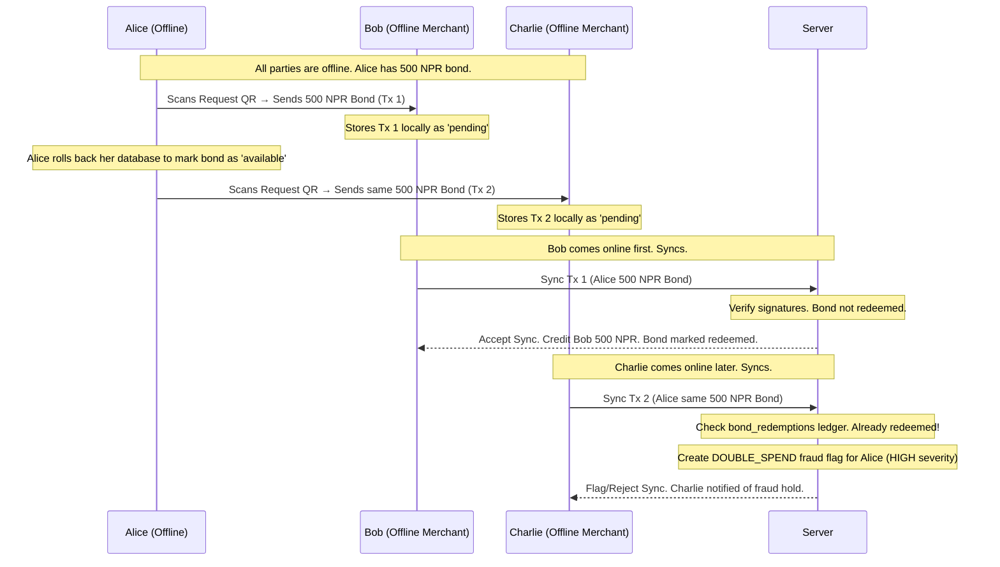

# BondPay — Exhaustive Technical, Architectural, and Financial Documentation
### Offline Bond-Based Payment System
**Stack: React Native (Expo) + Node.js (Express.js) | Version: 1.0.0 (NCIT TechFest 3.0 MVP & Production Roadmap)**

---

## Table of Contents

1. [Executive Summary](#1-executive-summary)
2. [Problem Statement & The Nepal Context](#2-problem-statement--the-nepal-context)
3. [The Core Concept: Digital Banknotes](#3-the-core-concept-digital-banknotes)
4. [System Architecture & High-Level Data Flow](#4-system-architecture--high-level-data-flow)
5. [The 4 Transaction Modes (Connectivity Matrix)](#5-the-4-transaction-modes-connectivity-matrix)
6. [Cryptographic Foundations & Handshake Protocol](#6-cryptographic-foundations--handshake-protocol)
7. [Mathematical Algorithms (Strict Pseudocode & Steps)](#7-mathematical-algorithms-strict-pseudocode--steps)
8. [Synchronization & Conflict Resolution Protocol](#8-synchronization--conflict-resolution-protocol)
9. [Solutions to Core Implementation Challenges](#9-solutions-to-core-implementation-challenges)
10. [Database Schema Architectures (Full SQL DDLs)](#10-database-schema-architectures-full-sql-ddls)
11. [Web API Specifications (JSON Request/Response Schemas)](#11-web-api-specifications-json-requestresponse-schemas)
12. [Frontend Services & Architectural Components](#12-frontend-services--architectural-components)
13. [Hardware Terminal: BondPay Station (RFID Checkout)](#13-hardware-terminal-bondpay-station-rfid-checkout)
14. [Security Threat Model & Threat Matrix](#14-security-threat-model--threat-matrix)
15. [Tech Stack & System Comparison Matrix](#15-tech-stack--system-comparison-matrix)
16. [Open Research Problems](#16-open-research-problems)
17. [Local Setup & Deployment Guide](#17-local-setup--deployment-guide)
18. [NCIT TechFest 3.0 Word-for-Word Pitch & Slide Guide](#18-ncit-techfest-30-word-for-word-pitch--slide-guide)

---

## 1. Executive Summary

BondPay is an offline-capable digital payment system designed for regions with unreliable internet connectivity (such as rural trekking routes or geographically isolated communities in Nepal) or scenarios where mobile data is prohibitively expensive for micro-transactions. 

Traditional digital wallets operate on account-based synchronous models, requiring constant internet access to deduct balance from the sender and credit it to the receiver. BondPay shifts this paradigm to a **token-based model**, treating digital money as discrete, server-signed objects called **"Bonds"** (analogous to physical banknotes). 

Users allocate a portion of their online balance to create offline bonds while connected to the internet. These bonds can then be transferred peer-to-peer face-to-face via optical QR codes, completely offline. The mathematical authenticity of the bonds and transaction authorization is verified offline by the receiver using asymmetric cryptographic signatures (Ed25519), while double-spending and ledger settlement are resolved when either party reconnects and syncs with the central server.

---

## 2. Problem Statement & The Nepal Context

### 2.1 The Nepal Infrastructure Challenge
1. **Remote Trekking Routes & Tourist Zones**: Trails like the Annapurna Circuit, Everest Base Camp, or Upper Mustang pass through zones where mobile networks are absent, or restricted to unstable 2G connections. Tourists and locals hold digital funds (in eSewa, Khalti, or bank apps) but are forced to carry physical cash.
2. **Data Cost vs. Micro-Transaction Value**: Initiating a mobile data connection to pay Rs.20 for tea is financially impractical when cellular data fees cost a significant fraction of the transaction itself.
3. **Intermittent Connectivity**: Rural shops and lodges may only obtain signal for a few hours a day or at specific spots, rendering synchronous transactions impossible.

### 2.2 Why Existing E-Wallets Fail Offline
Traditional wallets rely on database records stored exclusively in the cloud. They lack a local cryptographically verifiable representation of value. Therefore:
- The sender cannot prove they have the funds.
- The receiver cannot verify that the sender’s balance was decremented.
- There is no mechanism to authorize transfers without real-time connection.

---

## 3. The Core Concept: Digital Banknotes

BondPay models digital money as physical cash using modern cryptography:
- **Server as the Central Bank**: The server signs and issues bonds using its private key, acting as an unforgeable digital watermark.
- **Offline Asymmetric Verification**: Devices use the server's public key (hardcoded) to verify bonds, and the sender's public key to verify transaction authorization completely offline.
- **Bounded Fraud Window**: The system accepts a limited risk window (like EMV card offline floor limits) rather than pretending double-spending can be prevented offline, resolving duplicates post-sync and enforcing velocity limits (3000 NPR cap).

### 3.1 What BondPay Guarantees Offline
- **Bond Authenticity**: The bond was issued by BondPay's server (`Ed25519` server signature).
- **Data Integrity**: The value and details of the bond have not been tampered with.
- **Transaction Authorization**: The sender explicitly authorized the transfer of the specific bonds to the specific receiver (`Ed25519` user signature).
- **Non-Repudiation**: The sender cannot claim they did not initiate the payment.

### 3.2 What BondPay Cannot Guarantee Offline
- **Double-Spending Prevention**: Without a real-time connection, the system cannot verify if the bond was already spent on a different offline device five minutes ago. This is resolved asynchronously during sync.

---

## 4. System Architecture & High-Level Data Flow

The BondPay ecosystem consists of:
1. **React Native (Expo) Mobile App**: Operates the offline wallet, camera/QR scanner, local SQLite ledger, and cryptographic engine.
2. **Node.js (Express.js) Backend**: Serves as the central clearing house, verifying signatures, handling sync operations, and managing Supabase PostgreSQL.
3. **Supabase (PostgreSQL) Database**: Authoritative cloud database storing user accounts, issued bonds, redemptions, and audit logs.
4. **BondPay Station (ESP8266 Hardware Terminal)**: A standalone physical terminal for offline card/RFID verification in merchant environments.

### 4.1 Data Flow: Bond Issuance (Online)
```
User App (Online)                     Server                     Database
    │                                   │                           │
    │  POST /bonds/issue {amount}       │                           │
    │──────────────────────────────────>│                           │
    │                                   │  1. SELECT FOR UPDATE     │
    │                                   │     (Lock user balance)   │
    │                                   │──────────────────────────>│
    │                                   │  2. Greedy denomination   │
    │                                   │     breakdown             │
    │                                   │  3. Sign each bond        │
    │                                   │  4. Deduct online balance │
    │                                   │  5. INSERT bonds          │
    │                                   │──────────────────────────>│
    │  {bonds[], newBalance}            │                           │
    │<──────────────────────────────────│                           │
    │                                   │                           │
    │  6. Store bonds in local SQLite   │                           │
    │     with status = 'available'     │                           │
```

### 4.2 Data Flow: Offline Payment (Optical QR Handshake)
```
Receiver App (Offline)                                   Sender App (Offline)
    │                                                            │
    │  1. Generate Request QR                                    │
    │     {receiverId, amount, mode: 'offline'}                  │
    │───────────────────────────────────────────────────────────>│ (Scan)
    │                                                            │
    │                                                            │  2. Exact change bond selection
    │                                                            │     (Subset-Sum Algorithm)
    │                                                            │  3. Biometric confirmation
    │                                                            │  4. Sign transaction payload
    │                                                            │     with User Private Key
    │                                                            │  5. Mark bonds as 'spent'
    │                                                            │  6. Generate Payment QR
    │<───────────────────────────────────────────────────────────│ (Scan)
    │
    │  7. Verify server signature on each bond
    │  8. Verify sender signature on transaction
    │  9. Verify sum of values match transaction total
    │ 10. Check bond expiry (TTL) and duplicate txIds
    │ 11. Save bonds as 'received_pending_sync'
    │     and transaction as 'pending'
```

---

## 5. The 4 Transaction Modes (Connectivity Matrix)

BondPay adapts dynamically to the network status of both the sender and receiver.

### 5.1 Mode 1: Online ↔ Online (Instant Transfer)
- **Condition**: Both sender and receiver are connected to the internet.
- **Mechanism**:
  1. Receiver generates a Request QR showing their ID, name, requested amount, and `mode: "online"`.
  2. Sender scans the QR, inputs or confirms the amount, and taps pay.
  3. Sender's app makes a synchronous request to `/wallet/transfer-online`.
  4. Server locks both users' rows (`SELECT ... FOR UPDATE`), deducts the sender's `online_balance`, increases the receiver's `online_balance`, and creates a transaction record (`P2P_ONLINE`).
  5. Both devices receive real-time HTTP confirmations.

### 5.2 Mode 2: Online → Offline (Pending Pickup)
- **Condition**: Sender is online; receiver is offline or unavailable.
- **Mechanism**:
  1. Sender initiates payment via `/wallet/transfer-pending` providing the receiver's ID and amount.
  2. Server deducts the amount from the sender's online balance and generates a `pending_pickup` record containing a unique 6-character pickup code and an Ed25519 signature from the server.
  3. Sender's screen displays a Pickup QR.
  4. Receiver scans the QR offline, verifying the server's signature locally to confirm the sender completed their step.
  5. The receiver stores the transaction locally with status `pending_pickup`.
  6. Once the receiver comes online, their background sync service sends a `POST /wallet/claim-pending` request. The server verifies the pickup and credits the receiver's online balance.

### 5.3 Mode 3: Offline → Online (Bond Transfer + Immediate Sync)
- **Condition**: Sender is offline (using bonds); receiver is online.
- **Mechanism**:
  1. Receiver generates a Request QR (`mode: "offline"`).
  2. Sender scans the QR, selects available local offline bonds matching the amount, hashes the transaction payload, and signs it using their private key. The app displays the Payment QR.
  3. Receiver scans the Payment QR, verifying the server's signature on the bonds and the sender's signature on the transaction offline.
  4. Because the receiver is online, the app immediately forwards the payload to `/transactions/sync`.
  5. The server redeems the bonds, credits the receiver's online balance, and confirms the transaction.

### 5.4 Mode 4: Offline → Offline (Bond Transfer + Deferred Sync)
- **Condition**: Both sender and receiver are offline.
- **Mechanism**:
  1. Receiver generates a Request QR (`mode: "offline"`).
  2. Sender scans, selects bonds, signs the transaction, and displays a Payment QR (using the multi-QR animated carousel if necessary).
  3. Receiver scans and validates the cryptographic signatures offline.
  4. Receiver's app saves the transaction to SQLite as `pending_sync`, and marks the incoming bonds as `received_pending_sync`.
  5. Senders mark their sent bonds as `spent` locally.
  6. **Settlement**: When *either* party regains internet connection, their app syncs with `/transactions/sync`. The server processes the sync batch, finalizes the balance adjustments, and updates the transaction logs.

---

## 6. Cryptographic Foundations & Handshake Protocol

Security is implemented at the application layer, ensuring data integrity, non-repudiation, and authenticity without transport-level security (TLS) or real-time central validation.

### 6.1 Asymmetric Signature Algorithm: Ed25519
BondPay utilizes the Ed25519 elliptic curve digital signature algorithm over RSA-2048 and ECDSA P-256 due to:
- **Compact Signature Size**: A deterministic 64-byte signature and a 32-byte public key prevent QR code bloat.
- **High Performance**: Rapid execution on mobile JavaScript engines.
- **Side-Channel Resistance**: Immune to timing attacks.

### 6.2 The Dual Key-Pair Architecture
1. **Server Keys**: The server has a single Ed25519 key pair. The private key remains secure in server environment variables. The public key is hardcoded into the mobile app and used to verify the authenticity of bonds.
2. **User Keys**: Every user generates an Ed25519 key pair on registration:
   - **Private Key**: Saved in `expo-secure-store` using device hardware security (Android Keystore / Apple Secure Enclave). Raw bytes cannot be extracted.
   - **Public Key**: Uploaded to the database during signup to verify that user's signatures during sync.

### 6.3 PBKDF2 Private Key Recovery
To solve the stolen or broken phone challenge, user private keys are backed up to the server in an encrypted format.
1. The user inputs their account password (used as the seed).
2. The client derives an encryption key from the password using **PBKDF2** (Password-Based Key Derivation Function 2) with a unique salt (stored on the server) and 100,000 iterations:
   $$K_{derive} = PBKDF2(password, salt, iterations=100000, keyLen=32)$$
3. The client encrypts the user's private key bytes using **AES-256-GCM** with the derived key $K_{derive}$.
4. The encrypted private key payload + GCM auth tag + IV is stored on the server's `users` table.
5. On a new device, after registering a new `active_device_id` via force login, the encrypted payload is downloaded, decrypted locally using $K_{derive}$ derived from the password, and stored securely in the local Keystore.

### 6.4 SHA-256 Hashing & Payload Binding
Before signing, JSON strings are structured, sorted, and hashed using SHA-256. 

To prevent **Bond Swapping Attacks** (where an attacker intercepts a signed transaction and swaps out the bonds), the transaction signature payload explicitly binds the specific bond IDs being spent.

```
bondIdsString = concatenateSorted(transaction.bondIds)
txPayload = txId + senderId + receiverId + totalAmount + timestamp + nonce + bondIdsString + message
txHash = SHA256(txPayload)
txSignature = Ed25519_Sign(txHash, senderPrivateKey)
```

```
bondPayload = bondId + value + ownerId + issuedAt + expiresAt + serverKeyVersion
bondHash = SHA256(bondPayload)
bondSignature = Ed25519_Sign(bondHash, serverPrivateKey)
```

### 6.5 Replay Protection
Every transaction payload includes a cryptographically secure 128-bit random hex `nonce` generated fresh:
```typescript
// In React Native:
const nonce = Crypto.getRandomBytes(16).map(b => b.toString(16).padStart(2, '0')).join('');
```
Since the `txId` is derived from hashing the payload (including `nonce` and `timestamp`), the transaction ID is unique. If an attacker replays the QR code, the receiver's SQLite DB rejects the duplicate `txId`, and the server rejects it via the `bond_redemptions` unique primary key constraint.

---

## 7. Mathematical Algorithms (Strict Pseudocode & Steps)

### 7.1 Greedy Denomination Breakdown (Issuance)
When a user loads NPR $X$ online balance to offline bonds, the server divides it into optimal denominations to facilitate exact-change spending. 

Available denominations (in paisa): `[1000, 500, 100, 50, 20, 10, 5]` (equivalent to NPR 10, 5, 1, 0.50, 0.20, 0.10, 0.05).

```
FUNCTION issueBonds(userId, totalAmount):
  IF totalAmount % 5 != 0 THEN
    RETURN error("Amount must be multiple of min denomination (5 paisa)")
  
  userBalance = DB.getBalance(userId)
  IF userBalance < totalAmount THEN
    RETURN error("Insufficient online balance")

  bonds = []
  remaining = totalAmount
  
  // Mixed denomination starter pack for flexibility (if amount is large)
  IF totalAmount > 10000 THEN
    starterPack = [1000, 500, 100, 100, 50, 50, 20, 20, 10, 10, 5, 5]
    FOR each val IN starterPack:
      IF remaining >= val THEN
        bonds.append(createSignedBond(val, userId))
        remaining -= val

  // Greedy allocation for the remaining balance
  denominations = [1000, 500, 100, 50, 20, 10, 5]
  FOR each denom IN denominations:
    WHILE remaining >= denom:
      bonds.append(createSignedBond(denom, userId))
      remaining -= denom

  DB.transaction():
    DB.deductBalance(userId, totalAmount)
    DB.insertBonds(bonds)
    
  RETURN { bonds: bonds, newBalance: userBalance - totalAmount }
```

### 7.2 Subset-Sum exact Change Algorithm (Spending)
When an offline sender receives a payment request of amount $T$, the app runs a memoized subset-sum algorithm over their local `available` bonds to find an exact combination.

```
FUNCTION selectBondsExactChange(availableBonds, targetAmount):
  // DP array tracks the list of bonds selected for each target weight
  DP = Array of size (targetAmount + 1) initialized to null
  DP[0] = [] // Base case: 0 weight needs 0 bonds

  FOR each bond IN availableBonds:
    // Iterate backwards to prevent using the same bond multiple times
    FOR w FROM targetAmount DOWNTO bond.value:
      IF DP[w - bond.value] is not null AND DP[w] is null THEN
        DP[w] = DP[w - bond.value] + [bond]

  IF DP[targetAmount] is null THEN
    RETURN { success: false, reason: "No exact change possible", alternatives: suggestClosestAmounts(availableBonds, targetAmount) }
  ELSE
    RETURN { success: true, selectedBonds: DP[targetAmount] }
```

### 7.3 Client Transaction Creation
```
FUNCTION createTransaction(sender, receiverQR, selectedBonds):
  FOR each bond IN selectedBonds:
    IF NOT verifyServerBondSignature(bond) THEN
      RETURN error("Invalid server signature on bond")
    IF bond.status != "available" THEN
      RETURN error("Bond already spent or unavailable")

  totalAmount = SUM(bond.value FOR bond in selectedBonds)
  IF totalAmount != receiverQR.requestedAmount AND receiverQR.requestedAmount != 0 THEN
    RETURN error("Requested amount mismatch")

  nonce = generateSecureNonce()
  timestamp = currentUnixTimestamp()
  
  txId = SHA256(sender.userId + receiverQR.receiverId + totalAmount.toString() + timestamp.toString() + nonce)
  sortedBondIds = selectedBonds.map(b => b.bondId).sort().join(",")
  
  txPayload = txId + sender.userId + receiverQR.receiverId + totalAmount.toString() + timestamp.toString() + nonce + sortedBondIds
  txSignature = Keystore.sign(SHA256(txPayload), "bondpay_user_private_key")

  SQLite.transaction():
    FOR each bond IN selectedBonds:
      SQLite.updateBondStatus(bond.bondId, "spent", txId)
    SQLite.insertTransaction({
      txId: txId,
      senderId: sender.userId,
      receiverId: receiverQR.receiverId,
      totalAmount: totalAmount,
      timestamp: timestamp,
      nonce: nonce,
      senderPublicKey: sender.publicKey,
      senderSignature: txSignature,
      syncStatus: "pending"
    })
    SQLite.insertTransactionBonds(txId, selectedBonds, "outgoing")

  RETURN { transaction: tx, bonds: selectedBonds }
```

### 7.4 Client Verification & Acceptance (Receiver Offline)
```
FUNCTION verifyAndAcceptPayment(paymentQR, receiverId):
  { transaction, bonds } = paymentQR

  // 1. Verify server signature on each bond
  FOR each bond IN bonds:
    IF NOT verifyServerBondSignature(bond) THEN
      RETURN error("Bond " + bond.bondId + " has forged server signature")
    IF bond.expiresAt <= currentUnixTimestamp() THEN
      RETURN error("Bond " + bond.bondId + " has expired")

  // 2. Verify bond values match transaction claims
  IF SUM(b.value FOR b in transaction.bonds) != transaction.totalAmount THEN
    RETURN error("Transaction total amount mismatch")

  // 3. Verify sender signature
  sortedBondIds = bonds.map(b => b.bondId).sort().join(",")
  txPayload = transaction.txId + transaction.senderId + transaction.receiverId + transaction.totalAmount.toString() + transaction.timestamp.toString() + transaction.nonce + sortedBondIds
  
  IF NOT Ed25519.verify(transaction.senderSignature, SHA256(txPayload), transaction.senderPublicKey) THEN
    RETURN error("Sender transaction signature invalid")

  // 4. Sanity checks (skew, duplicates)
  IF transaction.timestamp > currentUnixTimestamp() + CLOCK_SKEW_TOLERANCE THEN
    RETURN error("Future transaction timestamp")
  IF SQLite.transactionExists(transaction.txId) THEN
    RETURN error("Duplicate transaction already processed")

  // 5. Store received bonds as pending sync
  SQLite.transaction():
    FOR each bond IN bonds:
      SQLite.upsertBond({
        bondId: bond.bondId,
        value: bond.value,
        ownerId: bond.ownerId,
        currentOwnerId: receiverId, // Set local owner
        issuedAt: bond.issuedAt,
        expiresAt: bond.expiresAt,
        serverSignature: bond.serverSignature,
        status: "received_pending_sync",
        localTxId: transaction.txId
      })
    SQLite.insertTransaction({
      txId: transaction.txId,
      senderId: transaction.senderId,
      receiverId: transaction.receiverId,
      totalAmount: transaction.totalAmount,
      timestamp: transaction.timestamp,
      nonce: transaction.nonce,
      senderPublicKey: transaction.senderPublicKey,
      senderSignature: transaction.senderSignature,
      syncStatus: "pending"
    })
    SQLite.insertTransactionBonds(transaction.txId, bonds, "incoming")

  RETURN { success: true, amount: transaction.totalAmount }
```

---

## 8. Synchronization & Conflict Resolution Protocol

Sync is executed in the background or triggered manually. The backend is designed as an asynchronous, zero-trust system.

### 8.1 The Sync Algorithm (Client-Side)
```
FUNCTION syncWithServer():
  IF NOT isOnline() THEN RETURN

  pendingTx = SQLite.getTransactions(status = "pending")
  IF pendingTx.isEmpty() THEN RETURN

  batch = {
    batchId: generateUUID(),
    incoming: pendingTx.filter(t => t.role == "receiver").map(t => ({
      transaction: t,
      bonds: SQLite.getBondsForTx(t.txId, "incoming")
    })),
    outgoing: pendingTx.filter(t => t.role == "sender").map(t => ({
      transaction: t,
      bonds: SQLite.getBondsForTx(t.txId, "outgoing")
    }))
  }

  response = API.post("/transactions/sync", batch)
  
  SQLite.transaction():
    FOR each txId IN response.accepted:
      SQLite.updateTransactionStatus(txId, "synced")
      // Delete spent outgoing bonds to save space
      SQLite.deleteSpentBondsForTx(txId)
      // Transition incoming bonds to available
      SQLite.updateBondsStatusForTx(txId, "available")
      
    FOR each txId IN response.rejected:
      SQLite.updateTransactionStatus(txId, "rejected")
      SQLite.updateBondsStatusForTx(txId, "failed")
      
    FOR each txId IN response.flagged:
      SQLite.updateTransactionStatus(txId, "flagged")
      SQLite.updateBondsStatusForTx(txId, "frozen")

  updateLocalBalances(response.updatedOnlineBalance)
```

### 8.2 The Sync Resolution (Server-Side)
```
FUNCTION processSyncBatch(batch):
  // Check for batch idempotency
  cached = DB.getSyncBatchResult(batch.batchId)
  IF cached is not null THEN RETURN cached

  accepted = [], rejected = [], flagged = []
  
  FOR each item IN batch.incoming:
    { transaction, bonds } = item
    
    // 1. Verify signatures, expiry, limits
    IF NOT verifyTransactionSignatures(transaction, bonds) THEN
      rejected.append(transaction.txId)
      CONTINUE

    // 2. Validate sender has active device authority at transaction time
    activeDevice = DB.getActiveDevice(transaction.senderId)
    IF activeDevice != transaction.senderDeviceId THEN
      rejected.append(transaction.txId)
      CONTINUE

    // 3. Double-Spend Check
    isDoubleSpent = FALSE
    FOR each bond IN bonds:
      IF DB.isBondRedeemed(bond.bondId) THEN
        isDoubleSpent = TRUE
        DB.insertFraudFlag({
          userId: transaction.senderId,
          txId: transaction.txId,
          bondId: bond.bondId,
          type: "DOUBLE_SPEND",
          severity: "HIGH"
        })
    
    IF isDoubleSpent THEN
      flagged.append(transaction.txId)
      CONTINUE

    // 4. Atomic Settlement
    DB.transaction():
      FOR each bond IN bonds:
        DB.redeemBond(bond.bondId, transaction.txId, transaction.receiverId)
      DB.creditBalance(transaction.receiverId, transaction.totalAmount)
      DB.insertTransactionRecord(transaction)
      
    accepted.append(transaction.txId)

  result = { accepted: accepted, rejected: rejected, flagged: flagged }
  DB.saveSyncBatch(batch.batchId, result)
  RETURN result
```

### 8.3 Detailed Double-Spend Conflict Scenarios



- **Scenario A: Receiver syncs before sender**: Bob syncs a payment from Alice. The transaction is validated, the bond marked redeemed, and Bob is credited. When Alice later syncs her outgoing log, it matches the redeemed state and is confirmed without issue.
- **Scenario B: Sender syncs before receiver**: Alice syncs her outgoing log. The server records the transaction state but does not credit Bob until Bob uploads his incoming sync batch containing his signature validation.
- **Scenario C: Multi-Device Sync Collisions**: If two sync requests for the same transaction hit the server simultaneously, SQL transaction locks (`FOR UPDATE` on `issued_bonds` and `users`) force the requests to resolve sequentially, preventing dual-crediting.
- **Scenario D: Receiver Never Syncs**: If Bob fails to go online before the bond TTL expires, the bond becomes invalid. Alice's online balance is not credited, and Bob's local wallet shows an expired error. Upon next sync, the server returns a `BOND_EXPIRED` rejection.
- **Scenario E: Double-Spend Flagging**: In the diagram above, Charlie's sync is flagged because the bond was already redeemed by Bob. The server logs the incident, suspends Alice's account, and resolves the ledger.

---

## 9. Solutions to Key Challenges

### 9.1 Phone Stolen/Broken (Private Key Recovery)
- **Problem**: Ed25519 private keys are stored locally. If a device is lost, the offline bonds are trapped.
- **Solution 1: Single Active Device (Force Login)**: If a user logs into a new device, the server checks the `active_device_id`. If it differs, a **Force Login** is initiated. This automatically revokes all user bonds (`status = 'revoked'`) on the server and credits their face values back to the user's `online_balance`.
- **Solution 2: PBKDF2 Backup**: The user's key pair is encrypted locally using an AES-256-GCM key derived from their password via PBKDF2 (100,000 iterations). The encrypted backup is stored on the server and recovered during onboarding.
- **Solution 3: Biometric Spending Confirmation**: Senders must complete a local biometric check (FaceID/Fingerprint) before signing and generating payment QR codes, preventing unauthorized spending on stolen devices.

### 9.2 The A → B → C Offline Chain (Double-Spend prevention)
- **Problem**: If A pays B offline, and B immediately pays C offline with the same bond, B can double-spend by syncing their balance before C.
- **Solution: Direct-to-Online Balance Model**: Received offline bonds are stored in the receiver's database as `received_pending_sync` (Orange UI, Pending Online Balance). **The app blocks users from spending bonds marked `received_pending_sync` offline**. They must go online and sync to convert the pending bonds into `online_balance` (Green UI), from which they can load fresh bonds.

### 9.3 QR Code Payload Size (Animated Multi-QR Carousel)
- **Problem**: A transaction with several signatures and bond structures exceeds 2000 characters. Scanning this as a single dense QR code fails on lower-end cameras.
- **Solution: Animated QR Carousel**: The client compresses the payload using deflate, base64 encodes the bytes, and splits them into **~300 character** chunks. The app displays these chunks sequentially in an animated carousel (3 Hz, 333ms per frame). The receiver scans the cycling frames, gathers the chunks via an accumulator map, verifies the checksum, and processes the complete payload.

**QR Chunk Envelope JSON**:
```json
{
  "v": 1,
  "sid": "A3F1B2",
  "i": 2,
  "t": 6,
  "d": "aGFzaC1kYXRhLXNlZ21lbnQ...",
  "cs": "4e7a89b1"
}
```

---

## 10. Database Schema Architectures (Full SQL DDLs)

### 10.1 Supabase PostgreSQL DDL (Server-Side)
```sql
-- Enable UUID extension
CREATE EXTENSION IF NOT EXISTS "uuid-ossp";

-- Users Table
CREATE TABLE users (
    user_id UUID PRIMARY KEY DEFAULT uuid_generate_v4(),
    phone_number TEXT UNIQUE NOT NULL,
    email TEXT UNIQUE NOT NULL,
    full_name TEXT NOT NULL,
    password_hash TEXT NOT NULL,
    public_key TEXT,
    online_balance BIGINT NOT NULL DEFAULT 0 CHECK (online_balance >= 0),
    is_frozen BOOLEAN NOT NULL DEFAULT false,
    registered_at TIMESTAMPTZ NOT NULL DEFAULT NOW(),
    active_device_id TEXT,
    ttl_hours INTEGER DEFAULT 72,
    encrypted_key_backup TEXT,
    key_backup_salt TEXT
);

-- Issued Bonds Table
CREATE TABLE issued_bonds (
    bond_id TEXT PRIMARY KEY,
    value BIGINT NOT NULL CHECK (value > 0),
    owner_id UUID NOT NULL REFERENCES users(user_id) ON DELETE CASCADE,
    issued_at TIMESTAMPTZ NOT NULL,
    expires_at TIMESTAMPTZ NOT NULL,
    server_key_version TEXT NOT NULL,
    server_signature TEXT NOT NULL,
    status TEXT NOT NULL DEFAULT 'active' CHECK (status IN ('active', 'redeemed', 'expired', 'revoked'))
);

CREATE INDEX idx_issued_bonds_owner ON issued_bonds(owner_id);
CREATE INDEX idx_issued_bonds_status ON issued_bonds(status);

-- Pending Pickups Table
CREATE TABLE pending_pickups (
    pickup_id TEXT PRIMARY KEY,
    sender_id UUID NOT NULL REFERENCES users(user_id) ON DELETE CASCADE,
    receiver_id UUID NOT NULL REFERENCES users(user_id) ON DELETE CASCADE,
    amount BIGINT NOT NULL CHECK (amount > 0),
    pickup_code TEXT UNIQUE NOT NULL,
    server_sig TEXT NOT NULL,
    status TEXT DEFAULT 'pending' CHECK (status IN ('pending', 'claimed', 'expired')),
    created_at TIMESTAMPTZ DEFAULT NOW(),
    expires_at TIMESTAMPTZ NOT NULL,
    claimed_at TIMESTAMPTZ
);

-- Transactions Table
CREATE TABLE transactions (
    tx_id TEXT PRIMARY KEY,
    tx_type TEXT NOT NULL DEFAULT 'P2P_OFFLINE' CHECK (tx_type IN ('P2P_OFFLINE', 'P2P_ONLINE', 'P2P_PENDING', 'BOND_LOAD', 'BOND_REVERSE', 'TOPUP')),
    sender_id UUID REFERENCES users(user_id) ON DELETE SET NULL,
    receiver_id UUID REFERENCES users(user_id) ON DELETE SET NULL,
    total_amount BIGINT NOT NULL CHECK (total_amount > 0),
    tx_timestamp TIMESTAMPTZ NOT NULL,
    nonce TEXT,
    sender_signature TEXT,
    message TEXT,
    is_offline BOOLEAN NOT NULL DEFAULT false,
    status TEXT DEFAULT 'accepted' CHECK (status IN ('accepted', 'pending', 'failed', 'flagged')),
    synced_at TIMESTAMPTZ DEFAULT NOW()
);

-- Bond Redemptions Table
CREATE TABLE bond_redemptions (
    bond_id TEXT PRIMARY KEY REFERENCES issued_bonds(bond_id) ON DELETE CASCADE,
    tx_id TEXT NOT NULL REFERENCES transactions(tx_id) ON DELETE CASCADE,
    redeemed_by UUID NOT NULL REFERENCES users(user_id) ON DELETE CASCADE,
    redeemed_from UUID REFERENCES users(user_id) ON DELETE SET NULL,
    redeemed_at TIMESTAMPTZ DEFAULT NOW(),
    batch_id TEXT NOT NULL
);

-- Fraud Flags Table
CREATE TABLE fraud_flags (
    flag_id UUID PRIMARY KEY DEFAULT uuid_generate_v4(),
    user_id UUID NOT NULL REFERENCES users(user_id) ON DELETE CASCADE,
    tx_id TEXT REFERENCES transactions(tx_id) ON DELETE CASCADE,
    bond_id TEXT REFERENCES issued_bonds(bond_id) ON DELETE CASCADE,
    flag_type TEXT NOT NULL CHECK (flag_type IN ('DOUBLE_SPEND', 'VELOCITY', 'REVIEW')),
    severity TEXT NOT NULL CHECK (severity IN ('LOW', 'MEDIUM', 'HIGH', 'CRITICAL')),
    details JSONB,
    created_at TIMESTAMPTZ DEFAULT NOW(),
    resolved_at TIMESTAMPTZ
);

-- Sync Batches Table
CREATE TABLE sync_batches (
    batch_id TEXT PRIMARY KEY,
    user_id UUID NOT NULL REFERENCES users(user_id) ON DELETE CASCADE,
    submitted_at TIMESTAMPTZ NOT NULL,
    processed_at TIMESTAMPTZ,
    result JSONB
);

-- System Config Table
CREATE TABLE system_config (
    config_key TEXT PRIMARY KEY,
    config_value TEXT NOT NULL,
    description TEXT,
    updated_at TIMESTAMPTZ DEFAULT NOW()
);
```

### 10.2 Client SQLite Table DDLs
```sql
-- Bonds Table
CREATE TABLE IF NOT EXISTS bonds (
    bond_id TEXT PRIMARY KEY,
    value INTEGER NOT NULL,
    owner_id TEXT NOT NULL,
    current_owner_id TEXT NOT NULL,
    issued_at INTEGER NOT NULL,
    expires_at INTEGER NOT NULL,
    issued_by_server TEXT NOT NULL,
    server_signature TEXT NOT NULL,
    status TEXT DEFAULT 'available',
    local_tx_id TEXT,
    received_at INTEGER,
    created_at INTEGER DEFAULT (strftime('%s','now'))
);

CREATE INDEX IF NOT EXISTS idx_bonds_status ON bonds(status);
CREATE INDEX IF NOT EXISTS idx_bonds_owner ON bonds(current_owner_id);

-- Transactions Table
CREATE TABLE IF NOT EXISTS transactions (
    tx_id TEXT PRIMARY KEY,
    sender_id TEXT NOT NULL,
    receiver_id TEXT NOT NULL,
    total_amount INTEGER NOT NULL,
    timestamp INTEGER NOT NULL,
    nonce TEXT NOT NULL,
    sender_public_key TEXT NOT NULL,
    sender_signature TEXT NOT NULL,
    role TEXT NOT NULL CHECK (role IN ('sender', 'receiver')),
    sync_status TEXT DEFAULT 'pending',
    synced_at INTEGER,
    rejection_reason TEXT,
    message TEXT,
    created_at INTEGER DEFAULT (strftime('%s','now'))
);

CREATE INDEX IF NOT EXISTS idx_tx_sync_status ON transactions(sync_status);

-- Transaction Bonds Joint Table
CREATE TABLE IF NOT EXISTS transaction_bonds (
    tx_id TEXT NOT NULL,
    bond_id TEXT NOT NULL,
    direction TEXT NOT NULL CHECK (direction IN ('outgoing', 'incoming')),
    PRIMARY KEY (tx_id, bond_id),
    FOREIGN KEY(tx_id) REFERENCES transactions(tx_id) ON DELETE CASCADE,
    FOREIGN KEY(bond_id) REFERENCES bonds(bond_id) ON DELETE CASCADE
);

-- Sync Log Table
CREATE TABLE IF NOT EXISTS sync_log (
    batch_id TEXT PRIMARY KEY,
    submitted_at INTEGER NOT NULL,
    status TEXT NOT NULL,
    tx_count INTEGER NOT NULL,
    accepted INTEGER,
    rejected INTEGER,
    flagged INTEGER,
    error_message TEXT
);
```

---

## 11. Web API Specifications (JSON Request/Response Schemas)

### 11.1 POST /auth/register
- **Request**:
  ```json
  {
    "phoneNumber": "+9779841567890",
    "email": "namaste@bondpay.com",
    "fullName": "Zenith Kandel",
    "password": "supersecurepassword",
    "publicKey": "aG9uZ3BheV91c2VyX2VlMjU1MTlfcHVibGljX2tleV9leGFtcGxlX2Jhc2U2NA==",
    "deviceId": "dev-3f982b-8a71"
  }
  ```
- **Response (201 Created)**:
  ```json
  {
    "userId": "3e9b1d8f-6b21-4113-bf7b-9cfb5a3bb401",
    "jwt": "eyJhbGciOiJIUzI1NiIsInR5cCI6IkpXVCJ9...",
    "expiresAt": "2026-07-27T19:30:00.000Z"
  }
  ```

### 11.2 POST /auth/login
- **Request**:
  ```json
  {
    "loginId": "+9779841567890",
    "password": "supersecurepassword",
    "deviceId": "dev-3f982b-8a71",
    "forceLogin": true
  }
  ```
- **Response (200 OK)**:
  ```json
  {
    "userId": "3e9b1d8f-6b21-4113-bf7b-9cfb5a3bb401",
    "fullName": "Zenith Kandel",
    "publicKey": "aG9uZ3BheV91c2VyX2VlMjU1MTlfcHVibGljX2tleV9leGFtcGxlX2Jhc2U2NA==",
    "jwt": "eyJhbGciOiJIUzI1NiIsInR5cCI6IkpXVCJ9...",
    "onlineBalance": 500000,
    "expiresAt": "2026-07-27T19:30:00.000Z"
  }
  ```

### 11.3 POST /bonds/issue
- **Request**:
  ```json
  {
    "totalAmount": 100000
  }
  ```
- **Response (200 OK)**:
  ```json
  {
    "bonds": [
      {
        "bondId": "BOND-9f8e7d6c-5b4a-3f2e-1d0c-9b8a7f6e5d4c",
        "value": 50000,
        "ownerId": "3e9b1d8f-6b21-4113-bf7b-9cfb5a3bb401",
        "issuedAt": 1782543600,
        "expiresAt": 1785135600,
        "issuedByServer": "base64-server-public-key-here",
        "serverSignature": "base64-server-generated-ed25519-signature-here"
      },
      {
        "bondId": "BOND-8f7e6d5c-4b3a-2f1e-0d9c-8b7a6f5e4d3c",
        "value": 50000,
        "ownerId": "3e9b1d8f-6b21-4113-bf7b-9cfb5a3bb401",
        "issuedAt": 1782543600,
        "expiresAt": 1785135600,
        "issuedByServer": "base64-server-public-key-here",
        "serverSignature": "base64-server-generated-ed25519-signature-here"
      }
    ],
    "newOnlineBalance": 400000
  }
  ```

### 11.4 POST /transactions/sync
- **Request**:
  ```json
  {
    "batchId": "sync-batch-uuid-73c683b6-9bb2",
    "incoming": [
      {
        "transaction": {
          "txId": "TX-nonce12345",
          "senderId": "48f10b77-382a-43c3-9828-e4b2e88a0e88",
          "receiverId": "3e9b1d8f-6b21-4113-bf7b-9cfb5a3bb401",
          "totalAmount": 50000,
          "timestamp": 1782544000,
          "nonce": "nonce12345",
          "senderPublicKey": "base64-sender-pubkey",
          "senderSignature": "base64-sender-sig",
          "message": "Offline tea payment"
        },
        "bonds": [
          {
            "bondId": "BOND-9f8e7d6c-5b4a-3f2e-1d0c-9b8a7f6e5d4c",
            "value": 50000,
            "ownerId": "48f10b77-382a-43c3-9828-e4b2e88a0e88",
            "issuedAt": 1782543600,
            "expiresAt": 1785135600,
            "issuedByServer": "base64-server-pubkey",
            "serverSignature": "base64-server-sig"
          }
        ]
      }
    ],
    "outgoing": []
  }
  ```
- **Response (200 OK)**:
  ```json
  {
    "accepted": ["TX-nonce12345"],
    "rejected": [],
    "flagged": [],
    "updatedOnlineBalance": 450000
  }
  ```

### 11.5 HTTP API Error Codes Matrix
| HTTP Status | Error Code | Meaning / Resolution |
|-------------|------------|----------------------|
| 400 | `INSUFFICIENT_BALANCE` | Online balance is lower than the requested bond loading amount. |
| 400 | `INVALID_DENOMINATION` | Requested denomination value is not in standard set. |
| 400 | `BOND_EXPIRED` | Sync failed because bond timestamp exceeds TTL. |
| 400 | `INVALID_SIGNATURE` | Server or user verification of signature failed. |
| 400 | `TRANSACTION_TOO_OLD` | Transaction timestamp exceeds maximum skew tolerance window. |
| 403 | `FRAUD_FLAGGED` | Account is frozen due to high fraud score flags. |
| 409 | `DOUBLE_SPEND` | Bond ID is already recorded in the `bond_redemptions` table. |
| 409 | `DEVICE_CONFLICT` | Device ID does not match active_device_id. |

---

## 12. Frontend Services & Architectural Components

### 12.1 SyncService (`sync.service.ts`)
Controls sync execution. Uses an execution mutex (`isSyncing`) to block concurrent threads.
- Queries SQLite `transactions` where `sync_status` is `pending`.
- Compiles the transactions and associated SQLite `bonds` into a `SyncBatch`.
- Post to `/transactions/sync`.
- If accepted: marks SQLite `transactions` as `synced` and deletes SQLite spent bonds from the local device to clear memory.
- If flagged/rejected: records the rejection errors in SQLite transactions.

### 12.2 CryptoService (`crypto.service.ts`)
Manages cryptographic functions:
- **`initializeUserKeys(userId)`**: Invokes `@noble/ed25519` to generate an asymmetric pair. Saves private key to hardware keystores and public key to SQLite/Supabase.
- **`signTransaction(data, userId)`**: Signs SHA-256 hash of transactions inside the Secure Enclave.
- **`verifyServerBondSignature(...)` & `verifySenderSignature(...)`**: Evaluates Ed25519 inputs against public keys offline.

### 12.3 MultiQRService (`multiqr.service.ts`)
Provides animated QR frame segmentation:
- **`encode(payload, chunkSize)`**: Deflates string, converts to Base64, and splits into chunk packages with indexing headers.
- **`createAccumulator(onComplete)`**: Tracks session frames, visual progress counts, and computes checksum validation upon sequence reassembly.

---

## 13. Hardware Terminal: BondPay Station (RFID Checkout)

The **BondPay Station** is an ESP8266-based offline RFID card checkout terminal.

### 13.1 Pin Connections Table
| MFRC522 Pin | ESP8266 NodeMCU Pin | Description |
|-------------|---------------------|-------------|
| **3.3V**    | 3.3V                | Power supply. **Warning: 5V will fry the MFRC522** |
| **RST**     | D3 (GPIO 0)         | Reset Pin |
| **GND**     | GND                 | Ground |
| **MISO**    | D6 (GPIO 12)        | SPI MISO |
| **MOSI**    | D7 (GPIO 13)        | SPI MOSI |
| **SCK**     | D5 (GPIO 14)        | SPI Clock |
| **SDA (SS)**| D8 (GPIO 15)        | Slave Select |

| LCD Pin (I2C) | ESP8266 Pin | Description |
|---------------|-------------|-------------|
| **VCC**       | VU / 5V     | LCD logic power |
| **GND**       | GND         | Ground |
| **SDA**       | D2 (GPIO 4) | I2C Data |
| **SCL**       | D1 (GPIO 5) | I2C Clock |

| Components | ESP8266 Pin | Description |
|------------|-------------|-------------|
| **Green LED Anode** | D4 (GPIO 2) | Flash on success (requires $220\Omega$ resistor to GND) |
| **Red LED Anode**   | D0 (GPIO 16)| Flash on failure (requires $220\Omega$ resistor to GND) |
| **Buzzer (+)**      | D9 (RX)     | Signal beeps (negative pin to GND) |

### 13.2 Firmware & Data Upload Guide
1. Install **Arduino IDE** and add the ESP8266 boards URL: `http://arduino.esp8266.com/stable/package_esp8266com_index.json` to Preferences.
2. Search and install board package: **esp8266** by ESP8266 Community.
3. Install dependencies from the Arduino Library Manager:
   - `MFRC522` by GithubCommunity
   - `LiquidCrystal I2C` by Frank de Brabander
   - `ArduinoJson` (v6.x or v7.x)
   - Download `ESPAsyncTCP` and `ESPAsyncWebServer` from GitHub and add as zip libraries.
4. Download the [LittleFS Upload Plugin](https://github.com/earlephilhower/arduino-esp8266littlefs-plugin) and place in your Arduino directory.
5. Set Board to **NodeMCU 1.0 (ESP-12E Module)**, Flash size: **4MB (FS: 2MB)**.
6. Open `BondPay_Terminal.ino`, compile, and click Upload.
7. Close the serial monitor, click **Tools → ESP8266 LittleFS Data Upload** to upload dashboard HTML and javascript to flash memory.

---

## 14. Security Threat Model & Threat Matrix

| ID | Threat Vector | Severity | Mitigation Strategy |
|----|---------------|----------|---------------------|
| **T1** | **Counterfeit Bonds** (Attacker mints fake bond tokens) | **HIGH** | Every bond contains a server Ed25519 signature. Receiver verifies this signature offline using the server's public key. Fake bonds are rejected offline. |
| **T2** | **Bond Value Tampering** (Attacker alters bond denomination) | **HIGH** | The server signature covers the value field (`bondId + value...`). Changing the value invalidates the signature. |
| **T3** | **Replay Attacks** (Intercepting and reusing a payment QR) | **MEDIUM**| Every transaction has a 128-bit random `nonce` and a `timestamp`. Replays are rejected by unique key constraints in local SQLite and server PostgreSQL. |
| **T4** | **Signature Forgery** (Attacker signs transactions as another user) | **HIGH** | User private keys are isolated in Android Keystore / Apple Secure Enclave. Transactions are signed using Ed25519 with SHA-256 pre-hashing, which has a 128-bit security level. |
| **T5** | **Man-in-the-Middle (MitM)** (Network interception of transactions) | **MEDIUM**| Transaction payloads are transferred directly between devices via optical QR codes. There is no active network interface to intercept. |
| **T6** | **Private Key Extraction** (Attacker reads private key from local files) | **HIGH** | Private keys are stored in secure storage (`expo-secure-store`) using hardware-level key isolation. Keys cannot be read, even on rooted devices. |
| **T7** | **Race Conditions (TOCTOU)** (Exploiting timing gaps to double-spend online) | **MEDIUM**| Server uses PostgreSQL `SELECT ... FOR UPDATE` pessimistic locks during transfers to queue concurrent transactions. |
| **T8** | **Expired Bonds Spend** (Attacker attempts to spend old bonds) | **LOW** | Expired bonds are rejected during local verification, and the server verifies `expires_at` during synchronization. |
| **T9** | **Sync Batch Replay** (Attacker resubmits processed sync batch) | **MEDIUM**| Sync batches use unique `batchId` keys. The server caches sync results in `sync_batches` to ensure idempotency. |
| **T10**| **Offline Double-Spending** (Attacker spends same bond to multiple offline users) | **HIGH** | Verified during server synchronization. The first redemption succeeds; subsequent syncs throw constraint violations on `bond_redemptions`. The double-spending user is flagged (`DOUBLE_SPEND` in `fraud_flags` table) and penalised (account frozen, velocity limit of 3000 NPR, legal terms). |

---

## 15. Tech Stack & System Comparison Matrix

### 15.1 Component Tech Stack Comparison
| Layer | Hackathon MVP | Production Upgrade | Rationale for Production Choice |
|-------|---------------|--------------------|---------------------------------|
| **Crypto Signature** | `@noble/ed25519` (Pure JS) | `react-native-quick-crypto` | 100x faster, compiles using C++ bindings. |
| **Key Storage** | `expo-secure-store` | `react-native-keychain` + attestation | Verifies hardware backing check (TEE/Keystore). |
| **Local SQL DB** | `expo-sqlite` (Unencrypted) | `op-sqlite` + SQLCipher | Enforces full database encryption on disk. |
| **QR Scanner** | `expo-camera` | `react-native-vision-camera` | Advanced frame processing and auto-focus control. |
| **Worker Queue** | Synchronous REST | BullMQ + Redis | Process sync batches asynchronously. |
| **Secrets Manager**| Node `.env` config file | HashiCorp Vault | Safe storage of the Server Private Key. |

### 15.2 Payment Alternatives Comparison
| Capability | BondPay | Physical Cash | eSewa / Khalti | Cryptocurrencies |
|------------|---------|---------------|----------------|------------------|
| **Offline Spend** | **✅ Yes** | ✅ Yes | ❌ No | ❌ No |
| **D2D Transfer** | **✅ Yes (QR)** | ✅ Yes (Physical) | ❌ No | ⚠️ Yes (App needed) |
| **Sync Settlement** | **Asynchronous** | Manual Deposit | Synchronous | Peer verification |
| **Audit Trails** | **✅ Cryptographic**| ❌ None | ✅ Database | ✅ Public ledger |
| **Hardware Terminals**| **✅ ESP8266 RFID** | ❌ Cash Registers | ❌ None | ❌ Point-of-Sale |

---

## 16. Open Research Problems

1. **TEE spend Counter Isolation**: Offline double-spending can theoretically be blocked if user private keys reside in a hardware TEE (Trusted Execution Environment) that strictly manages a monotonically increasing transaction count, refusing to sign if the counter jumps. Developing an accessible API for this across arbitrary Android/iOS hardware is an open research problem.
2. **Denomination Fragmentation**: As bonds change hands offline, denomination ratios become skewed (e.g., too many small denominations vs. none). Balancing offline changes without central coordination is a hard distribution problem.
3. **Revocation Propagation Offline**: If a server revokes a bond ID, this fact cannot propagate to other offline devices before sync. Mitigating this risk depends on keeping bond TTL windows narrow.
4. **Offline synchronization conflict resolution in multi-party chains**: Reconstructing un-synced transactions from arbitrary peer hops without real-time ledgers is mathematically challenging.
5. **Anonymity vs Accountability**: Designing offline cash systems that preserve financial privacy while ensuring strict AML/KYC logging of double-spend attempts.

---

## 17. Local Setup & Deployment Guide

### 17.1 Backend Setup
1. Clone the project and navigate to the server folder:
   ```bash
   cd bondpay-server
   npm install
   ```
2. Set up environment configurations:
   ```bash
   cp .env.example .env
   ```
   *Edit `.env` and fill in your Supabase connection parameters and base64 server private key.*
3. Run migrations on your Supabase PostgreSQL instance using the `schema.sql` file.
4. Launch the local development server:
   ```bash
   npm run dev
   ```

### 17.2 Mobile App Setup
1. Navigate to the mobile app folder:
   ```bash
   cd BondPay
   npm install
   ```
2. Launch the Metro bundler:
   ```bash
   npx expo start
   ```
3. Press `a` for Android Emulator, `i` for iOS Simulator, or scan the QR code using the Expo Go app.

---

## 18. NCIT TechFest 3.0 Word-for-Word Pitch & Slide Guide

- **Presentation Duration**: 10 minutes (Keep script tight)
- **Visuals**: Modern UI, high contrast, clean typography

### 18.1 Slide 1: Title Slide
- **Slide Title**: BondPay
- **Subtitle**: Offline Bond-Based Payment System
- **Tagline**: *"Payments shouldn't stop when the internet does."*
- **Visual Action**: Render the BondPay logo and system diagram.
- **Verbal Script**: 
> "Good morning, respected judges and tech enthusiasts. We are Team Spark, and today we are addressing a critical infrastructure gap in digital payments. In Nepal, approximately 35% of rural communities suffer from unreliable or absent internet connectivity. When the network goes down, e-wallets fail. We present BondPay: a digital payment system that works completely offline using cryptographic bonds. Payments shouldn't stop when the internet does."

### 18.2 Slide 2: The Problem
- **Slide Title**: Nepal's Digital Payment Gap
- **Bullet Points**:
  - Remote routes (trekking) have zero mobile networks.
  - High data costs for small micro-payments.
  - Intermittent connection makes cloud database balance queries impossible.
- **Visual Action**: Render a map of Nepal showing network gaps.
- **Verbal Script**:
> "Traditional wallets require real-time connectivity to execute transactions. Imagine trekking the Annapurna Circuit or Everst Base Camp trail. You want to pay Rs.200 for tea, but you have no signal. Even in Kathmandu, users are reluctant to buy expensive cellular data packs just to make a micro-payment. The problem isn't lack of funds; it's the lack of real-time access to the cloud ledger."

### 18.3 Slide 3: The Innovation: Digital Banknotes
- **Slide Title**: The Bond Token Model
- **Bullet Points**:
  - Bonds represent discrete currency bills, not simple database numbers.
  - Server private key acts as the 'central bank watermark'.
  - Mathematical verifiability offline using Ed25519 signatures.
- **Visual Action**: Render a physical banknote comparison diagram.
- **Verbal Script**:
> "BondPay replaces database numbers with 'Bonds'—mathematical representations of banknotes. When online, you deduct balance to load a bond. The server signs the bond with its private key. This signature acts as an unforgeable watermark. You can now transfer this bond offline via QR codes, and any device can verify its authenticity using the server's public key."

### 18.4 Slide 4: The 4 Transaction Modes
- **Slide Title**: Adaptive Connectivity Matrix
- **Bullet Points**:
  - Mode 1: Online-Online (Instant transfer)
  - Mode 2: Online-Offline (Pending pickup)
  - Mode 3: Offline-Online (Bond transfer + immediate sync)
  - Mode 4: Offline-Offline (Bond transfer + deferred sync)
- **Visual Action**: Render the 4-quadrant transaction matrix.
- **Verbal Script**:
> "Connectivity is fluid, so BondPay adapts. If both users are online, we transfer instantly (Mode 1). If the sender is online but the receiver is offline, we create a secure pending pickup (Mode 2). When the sender is offline but the receiver is online, we transfer a bond and sync immediately (Mode 3). If both are offline, we complete the transaction peer-to-peer and defer sync (Mode 4)."

### 18.5 Slide 5: The Cryptographic Handshake
- **Slide Title**: Secure Offline Verification
- **Bullet Points**:
  - Ed25519 produces compact 64-byte signatures.
  - SHA-256 pre-hashing prevents length-extension attacks.
  - Hashing binds bond IDs to transaction signatures, preventing swapping.
- **Visual Action**: Render the QR payload cryptographic hashing equation.
- **Verbal Script**:
> "How do we ensure security offline? We use Ed25519 asymmetric cryptography. During a payment, the sender selects bonds, hashes the payload—binding the bond IDs to the signature—and signs it using their private key stored in the secure hardware enclave. The receiver scans and verifies both the server's signature on the bonds and the sender's signature on the transaction. All verification is done locally without internet."

### 18.6 Slide 6: Database & Schemas
- **Slide Title**: Synchronous Ledgers & SQLite
- **Bullet Points**:
  - Cloud server uses Supabase (PostgreSQL) with row-level locks.
  - Client devices maintain local SQLite ledgers.
  - `bond_redemptions` table prevents double-spend replays.
- **Visual Action**: Render the relational ER schema.
- **Verbal Script**:
> "Our database design ensures consistency. The cloud server runs PostgreSQL, using SELECT FOR UPDATE row locking to prevent race conditions. The client app uses SQLite to maintain a local ledger of bonds, transactions, and joint tables, logging every incoming and outgoing offline balance change."

### 18.7 Slide 7: Mitigating Double-Spending
- **Slide Title**: Bounded Risk Acceptance
- **Bullet Points**:
  - Post-sync double-spend detection via `bond_redemptions` database checks.
  - Account suspension and fraud flagging (`DOUBLE_SPEND` in `fraud_flags` table).
  - Velocity limits, configurable TTL, and biometric spending constraints.
- **Visual Action**: Flowchart of double-spend sync conflict resolution.
- **Verbal Script**:
> "Let's be realistic: no offline system can block double-spending at the moment of payment without specialized hardware. BondPay manages this through bounded risk. We enforce a 3,000 NPR cap on offline bonds, secure the app with biometrics, and use configurable exipry times. If a double-spend occurs, the server catches it during sync, freezes the fraudster's account, and resolves the ledger. This matches the floor-limit models of global EMV credit cards."

### 18.8 Slide 8: Interactive Demo Set
- **Slide Title**: Live System Walkthrough
- **Visual Action**: Live demo on physical devices. (Seller: Merchant terminal / Buyer: Trekker app).
- **Verbal Script**:
> "Now let us show you this in action. We have two physical devices here. Both are set to airplane mode—completely offline. The merchant generates a Rs.100 payment request. The buyer scans it, authorizes it using fingerprint biometrics, and displays the payment confirmation QR. The merchant scans the payment QR, verifies the signatures offline, and stores the Rs.100 bond. The checkout is complete. We then connect the merchant to the internet, tap sync, and show the balance credit on the cloud ledger."

### 18.9 Slide 9: Hardware Terminal
- **Slide Title**: BondPay Station
- **Bullet Points**:
  - ESP8266 microcontroller hosting local AP and Web Dashboard.
  - RFID MFRC522 integration for contactless offline card checkout.
  - LCD screen diagnostics and LED success indicators.
- **Visual Action**: Show the physical ESP8266 node diagram.
- **Verbal Script**:
> "To prove commercial readiness, we designed the BondPay Station. This is an ESP8266 NodeMCU terminal integrated with an RFID reader and I2C LCD screen. Merchants can access a local dashboard hosted on the device to register customer cards, monitor offline payments, and execute local diagnostics without internet."

### 18.10 Slide 10: Conclusion & Roadmap
- **Slide Title**: Engineering a Connected Nepal
- **Bullet Points**:
  - Solves payment gaps for the 35% offline rural community.
  - Secure, standards-compliant development path (Nagrik App, NRB).
  - Complete, production-ready codebase and hardware integrations.
- **Visual Action**: Team members contact information slide.
- **Verbal Script**:
> "BondPay bridges the gap between rural cash dependency and digital convenience. By combining asymmetric signatures, secure enclaves, and offline-first databases, we have built a functional payment network ready for deployment. Thank you for your time. We are now open for questions."
