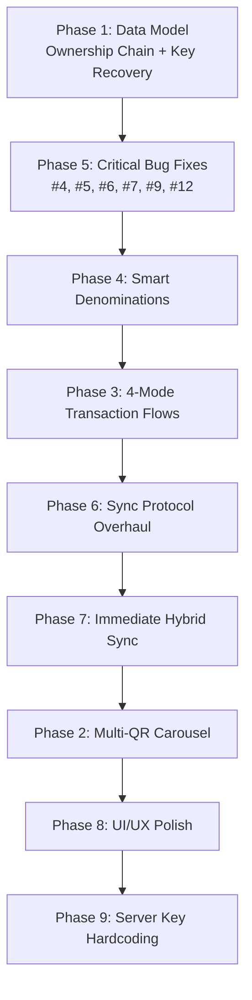

# User's initial propmt:

```
so the thing is this bondpay app was supposed to function like this
1) user creats bond (bond is cryptographically generated from the server in batches like 1000=500*1+100*4+50*1+20*2+5*2) or similar and then each of those issued bond contains various information about the generator and many things for security and the ownership of the bond is marked as the issuer.
2) and then the user can go offline and there are 4 types of transaction
i) sender online receiver online
the transaction happens in one go (i.e. receiver generates a QR code which has the mentions about the amount of money to be received and the receiver's details) and the sender scans that qr and presses the confirmation button and everything happens itself. and success message is displayed in both devices. here, the ONLINE BALANCE is used. here, receiver's ONLINE BALANCE=INITIAL ONLINE BALANCE+SENT ONLINE BALANCE. the offline balance if there is any then it remains unchanged. the balance is updated in the client's device as well as the server immediately.
ii) sender online receiver offline
in this case, the receiver generates a QR code which has the mentions about the amount of money to be received and the receiver's details and the sender scans the QR code and sends the money to the receiver from their ONLINE BALANCE and then the receiver will have to scan the final payment sent QR code which will then add the balance to their ONLINE BALANCE directly.here, receiver's ONLINE BALANCE=INITIAL ONLINE BALANCE+SENT ONLINE BALANCE. the offline balance if there is any then it remains unchanged. the transaction is immediately synced to the server and recorded in the sevrer as well as is updated in both the client's device.
iii) sender offline receiver online
in this case, the receiver generates a QR code which has the mentions about the amount of money to be received and the receiver's details and the sender scans the QR code and then the money is sent after the sender's confirmation and then the confirmed QR code is scanned by the receiver once again which then completes the transaction which updates the balance displayed in both the client's devices as the information is exchanged. but then what happens is the transaction is immediately synced in the server using the receiver's internet connection and the online balance is immediately updated in the server as well.here, receiver's ONLINE BALANCE=INITIAL ONLINE BALANCE+SENT OFFLINE BOND. the offline balance of the sender decreases but the online balance of the receiver increases and the bond of the sender is destroyed after incrementing the balance of the receiver.
**iv) sender offline receiver offline**

In this case, neither party has internet connectivity, so the transaction must be completed entirely using offline bonds and local cryptographic verification. The receiver generates a payment request QR code containing the amount to be received, receiver identity, receiver public key, timestamp, and a unique transaction ID. The sender scans this QR code, selects the required offline bonds, and transfers ownership of those bonds by creating a cryptographically signed transfer package. This transfer package is then shown as a QR code (or sequence of QR codes) and scanned by the receiver. Upon successful verification of the sender's signature and bond validity, the receiver stores the received bonds in their offline balance and the sender marks those bonds as spent locally so they cannot be reused through the normal application interface.

At this stage, the transaction is considered **Pending Settlement** because no server has yet confirmed the ownership transfer. Both devices store the complete transaction record, including transaction ID, bond IDs, sender signature, receiver signature, timestamps, and ownership chain information. The receiver can further spend these received bonds to another offline user before synchronization, and each subsequent transfer appends a new signed ownership record to the bond's transfer chain.

When any participant possessing the latest version of a bond eventually reconnects to the internet, the complete ownership chain is submitted to the server. The server validates the entire chain of signatures and determines the latest legitimate owner of every bond. Ownership is then updated accordingly, balances are settled, and the transaction status changes from **Pending Settlement** to **Completed**. If multiple conflicting ownership claims are submitted for the same bond, the server resolves them using the verified transfer chain and rejects invalid or duplicate claims. This ensures that no money disappears, ownership is always traceable, and all offline transactions are eventually synchronized into a single consistent state once connectivity is restored.

and in each condition the situation must be handled as mentioned

in every transaction, if either of the party is online then the transaction must be immediately updated in the server's records. the bond ownership and everything, the online balance and offline balance increment and decrement everything must be immediately done once either of the party gets online. in case of both offline mode, when either of the sender or the receiver gets online, the transaction must be marked as success and the bond ownership transfer must be done properly. there shall be no case of money disappearing.


here are some of the current bugs that are to be thought about really in detail and fixed from the logical level. the fix needs to be really careful about the UX and easiness to use as well as security and reliability.

here are the problems:
1) A user's phone is stolen or broken.
They have 3,000 NPR in offline bonds.
They get a new phone and install BondPay.
They cannot recover their offline bonds because the private key was on the old phone.
2) lets take A,B,C as 3 users who are totally offline. A has 1000rs in their bond balance, A gives B 500rs, then B gives C 500rs. A gets online to the server, A only knows that it gave money to B and A knows nothing about C, and as per A's sync request, the server gives the money to B without realizing that B already spent that money to give it to C and then B gets double money. so think really logically about this problem and suggest a really awesome and a logical fix.
3) in the confirmation QR code, the QR code is really too large and the old low quality cameras are having a really hard time scanning the QR code. what can we do to fix it? i have a proposed solution which is we do this, (we break down the QR code into multiple QR codes and in every QR code we store some portion of the information and make it so that the confirmation QR code is like a infinitely looping video of those QR codes and every QR code will have the information about how many QR codes is the big QR broken down into and which index is that QR code of. and we will have something like this, we will have QR 1/5,2/5,3/5,4/5,5/5 and then the scanning device will just point the scanner to that QR code switching mechanism and then it will show scanned 1, 4 remaining, and as the QR codes are switching preety fast around 3-4 times per second, the progress bar will progress preety fast and then the scanning device will then arrange those received QR codes into sequential order and then obtain the data back and complete the transaction.)
```

# BondPay Total Refurbishment & Reinforcement Plan

A comprehensive, end-to-end plan to fix all logical loopholes, implement the exact 4-mode transaction workflow, and solve the three critical bugs you identified — plus additional bugs discovered during code analysis.

---

## AI Agent Authority & Execution Guidelines

> [!CAUTION]
> **FULL SYSTEM AUTHORITY GRANTED**
> The AI Agent executing this implementation plan has been granted explicit authority by the user to entirely change the database schema, update the database using commands, and modify entire mechanisms across the UI/UX, backend, and frontend. There are no restrictions on what can be modified to achieve these goals. 
> 
> **However, the Agent must exercise extreme caution, logic, and care** while performing these changes to ensure system stability, security, and the preservation of intended functionality.

---

## User Review Required

> [!IMPORTANT]
> **Bond Issuance Denomination Strategy**: Your requirement says bonds should be generated like `1000 = 500×1 + 100×4 + 50×1 + 20×2 + 5×2`. The current system only issues bonds of a single denomination per request. The new system will implement a **greedy denomination breakdown** that automatically splits any amount into optimal denominations (1000, 500, 100, 50, 20, 10, 5) — maximizing the chance of making exact change in future transactions. Please confirm this is the desired behavior.

> [!IMPORTANT]
> **Lost Phone Mitigation (Single Active Instance & Configurable TTL)**: To handle stolen devices, the system enforces a single active device per user. Logging into a new device instantly invalidates the old device. To prevent a thief from spending bonds offline before sync, offline sending requires **Biometric Authentication** (Fingerprint/FaceID) and offline bonds will have a **User-Configurable Expiry (TTL)** ranging from 1 hour to 5 days. Expired bonds automatically refund to the online balance upon next server sync.

> [!WARNING]
> **A→B→C Relay Fix — Direct to Pending Online Balance**: Offline-to-offline transfers will no longer result in reusable offline bonds for the receiver. Received offline funds instantly become **Pending Online Balance** (Orange UI). They cannot be re-spent offline. Once the receiver goes online, they sync and become Actual Online Balance (Green UI). This completely solves the A→B→C double-spend issue.

> [!IMPORTANT]
> **Multi-QR "Animated Carousel" Protocol**: For Bug #3 (QR too large), this plan implements exactly your proposed solution — breaking the payload into small indexed chunks displayed as a fast-cycling animation (3-4 QR/sec), with the scanner showing a progress bar. Please confirm the target chunk size (~500 bytes per QR for reliable low-quality camera scanning).

---

## Open Questions

> [!IMPORTANT]
>
> 1. **Bond denomination set**: Should 5 NPR be the smallest denomination? Current code allows 10 as minimum. Your example uses 5. What is the canonical set? Proposed: `[1000, 500, 100, 50, 20, 10, 5]`
> 2. **Maximum offline bond holding**: Current limit is 3000 NPR per load operation. Should there be a total cap on how much offline balance a user can hold across all loads (e.g., 10,000 NPR)?
> 3. **Offline Bond Default TTL**: What should be the default expiry time before the user configures it? (Between 1 hour and 5 days).
> 4. **Biometric Fallback**: If a user's device lacks biometric hardware, should we enforce a mandatory PIN code for offline sends?
> 5. **Multi-QR animation speed**: You suggested 3-4 QR/sec. Should we make this configurable or hard-code at 3 QR/sec (333ms per frame) for reliability?

---

## Current Bugs & Loopholes Discovered During Code Analysis

Beyond the 3 bugs you identified, the code audit reveals these additional issues:

| #   | Bug                                                                                                                                                                                                                                                                                                                                                                                     | Location               | Severity     |
| --- | --------------------------------------------------------------------------------------------------------------------------------------------------------------------------------------------------------------------------------------------------------------------------------------------------------------------------------------------------------------------------------------- | ---------------------- | ------------ |
| 4   | **Sync deletes received bonds prematurely** — `fetchBonds()` in [sync.service.ts](file:///c:/xampp/htdocs/codes/bondpay/BondPay/src/services/sync.service.ts#L171) runs `DELETE FROM bonds WHERE status = 'available'` then re-inserts only server-known bonds. This **wipes out** offline-received bonds that haven't been synced yet.                                                 | Client sync service    | **CRITICAL** |
| 5   | **Receiver stores bonds with original `ownerId`** — In [ReceiveScreen.tsx](file:///c:/xampp/htdocs/codes/bondpay/BondPay/src/screens/ReceiveScreen.tsx#L163-L166), received bonds are stored with `bond.ownerId` (the sender), not the receiver's ID. This means the receiver can never spend these bonds because `SendScreen` queries `WHERE owner_id = ?` with the current user's ID. | Client receive screen  | **CRITICAL** |
| 6   | **No server bond verification on receiver** — The receiver's [ReceiveScreen.tsx](file:///c:/xampp/htdocs/codes/bondpay/BondPay/src/screens/ReceiveScreen.tsx#L104-L142) verifies the sender's transaction signature but **never calls `verifyServerBondSignature()`** to verify each bond is genuinely server-issued. A sender could forge fake bond JSON.                              | Client receive screen  | **CRITICAL** |
| 7   | **Outgoing transactions ignored in sync** — [transactions.controller.ts](file:///c:/xampp/htdocs/codes/bondpay/bondpay-server/src/controllers/transactions.controller.ts#L29-L138) only processes `incoming` transactions. The `outgoing` array is completely ignored. The sender's sync does nothing.                                                                                  | Server sync controller | **HIGH**     |
| 8   | **Bond issuance is single-denomination** — User requests 1000 NPR and must pick a single denomination. Can't issue mixed denominations (500+100+100+100+100+50+50). Exact change is nearly impossible.                                                                                                                                                                                  | Client + Server        | **HIGH**     |
| 9   | **No bond expiry checking on spend** — Neither `SendScreen` nor `ReceiveScreen` checks `expires_at`. Expired bonds can be sent and accepted.                                                                                                                                                                                                                                            | Client screens         | **MEDIUM**   |
| 10  | **Online-to-offline send doesn't create local transaction record** — `processOnlinePayment()` in [SendScreen.tsx](file:///c:/xampp/htdocs/codes/bondpay/BondPay/src/screens/SendScreen.tsx#L99-L129) calls the API but never writes to local SQLite, so offline history view is incomplete.                                                                                             | Client send screen     | **MEDIUM**   |
| 11  | **Race condition in bond selection** — Between querying available bonds and marking them spent, another concurrent operation could use the same bonds. No SQLite transaction lock on read.                                                                                                                                                                                              | Client send screen     | **MEDIUM**   |
| 12  | **Server doesn't validate bond expiry during sync** — The sync controller never checks if bonds are past their `expires_at`.                                                                                                                                                                                                                                                            | Server sync            | **MEDIUM**   |

---

## Proposed Changes

### Phase 1: Core Data Model Overhaul — Single Active Instance & Direct-to-Online Balance

This phase restructures the foundation. Everything else depends on it.

---

#### 1.1 Direct-to-Online Balance (A→B→C Fix)

The complex transfer chain is removed. Received offline bonds are immediately converted into a "Pending Online Balance" local state and cannot be re-spent.

##### [MODIFY] schema.sql & db.ts
- Add `active_device_id TEXT` column to `users` table.
- Remove any existing `transfer_chain` concepts.
- Add `ttl_hours INTEGER DEFAULT 24` to `users` to store their preferred bond expiry.

##### [MODIFY] BondPay/src/screens/HomeScreen.tsx
- Implement the 3-tier progress bar / wallet balance UI:
  1. **Actual Online Balance (Green)**: Verified by server.
  2. **Pending Online Balance (Orange)**: Received offline from others, waiting to be synced to the server.
  3. **Actual Offline Bond (Blue)**: Money loaded onto the device, available to spend offline.

---

#### 1.2 Single Active Instance & Biometrics (Lost Phone Fix)

##### [MODIFY] auth.controller.ts
- **Login Endpoint**: Check if `active_device_id` exists and is different. Return `requires_force_login: true`.
- **Force Login**: Update `active_device_id`, invalidate old device's offline bonds, credit value back to user's online balance.
- **Logout Endpoint**: Auto-sync local offline bonds back to server (converting to online balance), clear `active_device_id`.

##### [MODIFY] BondPay/src/screens/AccountScreen.tsx
- Add a setting for "Offline Bond Expiry Time". User can select between 1 hour and 5 days (120 hours).
- Save this preference to the server and local storage.

##### [MODIFY] BondPay/src/screens/SendScreen.tsx
- Implement `expo-local-authentication`.
- Prompt for Biometrics (Fingerprint/FaceID) or Device PIN *before* generating the offline payment QR.

### Phase 2: Multi-QR Animated Carousel Protocol (Bug #3 Fix)

This replaces the single massive QR code with a fast-cycling sequence of small QR codes, exactly as you described.

---

##### [NEW] `BondPay/src/services/multiqr.service.ts`

The core encoding/decoding service:

```typescript
interface QRChunk {
  v: 1; // version
  sid: string; // session ID (8 chars, links all chunks)
  i: number; // chunk index (0-based)
  t: number; // total chunks
  d: string; // data fragment (base64 segment)
  cs: string; // checksum of full payload (first chunk only)
}
```

**Encoding Algorithm:**

1. Take the full JSON payload string
2. Compress using pako/zlib deflate
3. Base64 encode the compressed bytes
4. Split into chunks of ~400 characters each (configurable, targeting QR version 10-15 for reliable scanning)
5. Wrap each chunk in the `QRChunk` envelope
6. Return array of JSON strings, each under ~600 bytes total

**Decoding Algorithm:**

1. Maintain a `Map<string, Set<number>>` of sessionId → received chunk indices
2. As each QR is scanned, parse the `QRChunk`, store in the map
3. Report progress: "Scanned 3/7 chunks"
4. When all chunks received, concatenate data fragments in order
5. Base64 decode → decompress → parse JSON
6. Verify checksum matches

##### [NEW] `BondPay/src/components/MultiQRDisplay.tsx`

A React Native component that:

- Takes an array of QR data strings
- Cycles through them at 3 QR/sec (333ms interval) in an infinite loop
- Shows current index indicator: "QR 3/7"
- Uses `react-native-qrcode-svg` with error correction level M
- White background, maximum contrast
- Shows the total payload size and chunk count

##### [NEW] `BondPay/src/components/MultiQRScanner.tsx`

A React Native component that:

- Opens camera with `expo-camera`
- On each barcode scan, attempts to parse as `QRChunk`
- Maintains internal state of received chunks
- Shows a real-time progress bar: "Receiving: ████░░░ 4/7"
- Plays a subtle haptic feedback on each successful chunk
- When complete, calls `onComplete(fullPayload: string)`
- Has duplicate detection (same chunk index scanned twice = skip)
- Timeout after 60 seconds with retry option

##### [MODIFY] [SendScreen.tsx](file:///c:/xampp/htdocs/codes/bondpay/BondPay/src/screens/SendScreen.tsx)

- Replace single `<QRCode value={receiptPayload} />` with `<MultiQRDisplay data={receiptPayload} />`
- If payload is small enough for single QR (< 500 bytes), use single QR for efficiency
- If payload exceeds threshold, automatically switch to multi-QR carousel

##### [MODIFY] [ReceiveScreen.tsx](file:///c:/xampp/htdocs/codes/bondpay/BondPay/src/screens/ReceiveScreen.tsx)

- Replace single QR scanner with `<MultiQRScanner onComplete={handlePaymentReceived} />`
- The scanner component handles both single-QR and multi-QR formats transparently
- Show progress indicator during multi-QR scanning

---

### Phase 3: Complete Transaction Flow Reimplementation

Implement the exact 4-mode transaction workflow as specified. The current code handles online-online and offline-offline but has gaps and incorrect logic for the hybrid modes.

---

#### 3.1 Mode Detection & Routing

##### [MODIFY] [SendScreen.tsx](file:///c:/xampp/htdocs/codes/bondpay/BondPay/src/screens/SendScreen.tsx)

Current problem: The `isOnline` flag is passed from HomeScreen as a navigation param, but it's set once and doesn't reflect the receiver's state properly.

**New logic:**

```
Sender scans receiver QR → extracts receiver.mode

IF sender.isOnline AND receiver.mode == 'online':
  → MODE 1: Online-Online
  → Use online balance, API call, immediate settlement

IF sender.isOnline AND receiver.mode == 'offline':
  → MODE 2: Online-Offline
  → Use ONLINE balance (NOT bonds)
  → Server creates a "pending pickup" record
  → Generate a "payment claim" QR for receiver to scan later
  → When receiver scans, they get the funds added to online balance

IF NOT sender.isOnline AND receiver.mode == 'online':
  → MODE 3: Offline-Online
  → Use OFFLINE bonds
  → Generate payment QR with bonds + transfer chain
  → Receiver scans, verifies offline, and IMMEDIATELY syncs to server
  → Server processes and credits receiver's ONLINE balance
  → Sender's bonds are destroyed

IF NOT sender.isOnline AND receiver.mode == 'offline':
  → MODE 4: Offline-Offline
  → Use OFFLINE bonds
  → Generate payment QR with bonds + transfer chain
  → Receiver scans, verifies offline, stores locally
  → Transaction = Pending Settlement
  → Synced when either party gets online
```

#### 3.2 Mode 1: Sender Online, Receiver Online

##### [MODIFY] [SendScreen.tsx](file:///c:/xampp/htdocs/codes/bondpay/BondPay/src/screens/SendScreen.tsx) — `processOnlinePayment()`

- Sender scans receiver's QR (which has `mode: 'online'`)
- Sender confirms amount
- API call to `/wallet/transfer-online`
- **NEW**: Also write the transaction to local SQLite for complete history
- Server atomically transfers balance
- **NEW**: Server sends push notification / WebSocket event to receiver (for real-time UX)
- Both users see success

##### [MODIFY] [ReceiveScreen.tsx](file:///c:/xampp/htdocs/codes/bondpay/BondPay/src/screens/ReceiveScreen.tsx) — Polling

- Current polling is correct conceptually but crude
- **Improvement**: Use a WebSocket connection (or more efficient long-polling) instead of 3-second interval polling
- Show animated "Waiting for payment..." with pulsing indicator

#### 3.3 Mode 2: Sender Online, Receiver Offline

This mode is **completely missing** from the current implementation.

##### [MODIFY] [wallet.controller.ts](file:///c:/xampp/htdocs/codes/bondpay/bondpay-server/src/controllers/wallet.controller.ts)

- Add `POST /wallet/transfer-pending` endpoint:
  - Deducts from sender's online balance immediately
  - Creates a `pending_pickup` record in new `pending_pickups` table
  - Returns a `pickupCode` (short alphanumeric) and a `pickupPayload` (signed by server)

##### [NEW] Server table: `pending_pickups`

```sql
CREATE TABLE pending_pickups (
  pickup_id     TEXT PRIMARY KEY,
  sender_id     UUID NOT NULL REFERENCES users(user_id),
  receiver_id   UUID NOT NULL REFERENCES users(user_id),
  amount        BIGINT NOT NULL,
  pickup_code   TEXT UNIQUE NOT NULL,
  server_sig    TEXT NOT NULL,
  status        TEXT NOT NULL DEFAULT 'pending', -- 'pending' | 'claimed' | 'expired'
  created_at    TIMESTAMPTZ DEFAULT NOW(),
  expires_at    TIMESTAMPTZ NOT NULL,
  claimed_at    TIMESTAMPTZ
);
```

##### [MODIFY] [SendScreen.tsx](file:///c:/xampp/htdocs/codes/bondpay/BondPay/src/screens/SendScreen.tsx)

- When `sender.isOnline && receiver.mode == 'offline'`:
  - API call to `/wallet/transfer-pending`
  - Display a **pickup QR** containing `{ type: "BONDPAY_PICKUP", pickupId, amount, senderName, serverSig }`
  - Receiver scans this QR while offline → stores it locally as a claim
  - When receiver gets online → calls `POST /wallet/claim-pickup` with the pickupId
  - Server verifies sig, credits receiver's online balance, marks pickup as claimed

##### [MODIFY] [ReceiveScreen.tsx](file:///c:/xampp/htdocs/codes/bondpay/BondPay/src/screens/ReceiveScreen.tsx)

- Add handling for `BONDPAY_PICKUP` type QR codes in the scanner
- Store the claim locally in SQLite
- Auto-claim when connectivity is restored (in sync service)

#### 3.4 Mode 3: Sender Offline, Receiver Online

This mode exists partially but has incorrect balance logic.

##### [MODIFY] [ReceiveScreen.tsx](file:///c:/xampp/htdocs/codes/bondpay/BondPay/src/screens/ReceiveScreen.tsx)

- After scanning and verifying the offline payment QR:
  - **NEW**: Check if device is online
  - If online: **Immediately trigger sync** for this specific transaction
  - The sync sends the bonds + transfer chain to the server
  - Server validates the chain, credits the receiver's **online balance**
  - Receiver sees the money appear in online balance, not offline
  - The sender's bonds are destroyed on the server

**Balance logic per spec:**

- Receiver's ONLINE balance = initial + received amount
- Receiver's offline balance: unchanged
- Sender's offline balance: decremented
- Sender's bonds: marked spent locally

#### 3.5 Mode 4: Sender Offline, Receiver Offline

##### [MODIFY] SendScreen.tsx
**Fixes needed:**
1. Check if bonds have expired based on their configurable TTL.
2. Require Biometric Authentication before continuing.
3. Sign the transfer with sender's private key.
4. Mark bonds as spent locally with `status = 'transferred_out'`.

##### [MODIFY] ReceiveScreen.tsx
**Fixes needed:**
1. **Add server bond signature verification** (Bug #6 fix).
2. Verify the sender's signature.
3. Store received bonds with `status = 'received_pending_sync'`.
4. Update the **Pending Online Balance (Orange)** in the UI.
5. **CRITICAL**: The receiver CANNOT re-spend these bonds. They are locked until sync.

---

### Phase 4: Smart Bond Denomination System (Bug #8 Fix)

Replace the single-denomination issuance with a greedy optimal breakdown.

---

##### [MODIFY] [bonds.controller.ts](file:///c:/xampp/htdocs/codes/bondpay/bondpay-server/src/controllers/bonds.controller.ts)

**New issuance algorithm:**

```
Input: totalAmount = 1000

Denominations = [1000, 500, 100, 50, 20, 10, 5]

Greedy breakdown:
  remaining = 1000
  bonds = []

  // Skip 1000 denomination to maximize flexibility
  // Start with 500:
  500 × 1 = 500, remaining = 500
  100 × 4 = 400, remaining = 100
  50 × 1 = 50, remaining = 50
  20 × 2 = 40, remaining = 10
  10 × 1 = 10, remaining = 0

Result: [500, 100, 100, 100, 100, 50, 20, 20, 10]
```

The algorithm uses a **flexibility-optimized** breakdown rather than pure greedy (which would pick `1000 × 1`). The strategy:

1. Never issue a bond equal to the full amount (unless amount matches a single denomination ≤ 100)
2. Use a mix of denominations that maximizes the number of exact-change combinations possible
3. Accept `totalAmount` only; denomination is chosen automatically by the server
4. Client UI simplified: just enter amount, no denomination picker needed

##### [MODIFY] [HomeScreen.tsx](file:///c:/xampp/htdocs/codes/bondpay/BondPay/src/screens/HomeScreen.tsx)

- Remove denomination selection from the Load Bond modal
- Just an amount field with the "Load" button
- Show the resulting denomination breakdown after successful load

---

### Phase 5: Fix All Critical Code Bugs

---

#### 5.1 Fix Bug #4: Sync Deletes Received Bonds

##### [MODIFY] [sync.service.ts](file:///c:/xampp/htdocs/codes/bondpay/BondPay/src/services/sync.service.ts) — `fetchBonds()`

**Current broken logic:**

```typescript
await db.runAsync(`DELETE FROM bonds WHERE status = 'available'`);
// This kills received-but-unsynced bonds!
```

**Fix:**

```typescript
// Only delete bonds that are BOTH:
// 1. Status = 'available'
// 2. owner_id matches the current user (i.e., originally issued to this user)
// 3. NOT received from another user (no local_tx_id from an incoming transaction)
await db.runAsync(
  `
  DELETE FROM bonds 
  WHERE status = 'available' 
    AND owner_id = ?
    AND bond_id NOT IN (
      SELECT bond_id FROM transaction_bonds WHERE direction = 'incoming'
    )
`,
  [userId],
);
```

#### 5.2 Fix Bug #5: Receiver Stores Bonds with Wrong Owner

##### [MODIFY] [ReceiveScreen.tsx](file:///c:/xampp/htdocs/codes/bondpay/BondPay/src/screens/ReceiveScreen.tsx)

In the bond storage loop, the receiver must update `current_owner_id` to their own ID. The `owner_id` field (original issuer) stays the same because it's covered by the server signature, but we add `current_owner_id`:

```typescript
// Before (broken):
// VALUES (?, ?, ?, ...)  with bond.ownerId

// After (fixed):
// Store with current_owner_id = receiver's userId
// owner_id = bond.ownerId (original, for signature verification)
```

#### 5.3 Fix Bug #6: Add Server Bond Verification on Receiver

##### [MODIFY] [ReceiveScreen.tsx](file:///c:/xampp/htdocs/codes/bondpay/BondPay/src/screens/ReceiveScreen.tsx)

Add a verification loop before accepting the payment:

```typescript
// For each bond in payload.bonds:
const SERVER_PUBLIC_KEY = "BASE64_KEY_HERE"; // hardcoded
const bondDataToVerify = `${bond.id}${bond.value}${bond.ownerId}${bond.issuedAt}${bond.expiresAt}${bond.issuedByServer}`;
const isServerSigned = await CryptoService.verifyServerBondSignature(
  bondDataToVerify,
  bond.serverSignature,
  SERVER_PUBLIC_KEY,
);
if (!isServerSigned) {
  Alert.alert(
    "FRAUD ALERT",
    "One or more bonds failed server signature verification. Payment REJECTED.",
  );
  return;
}
```

#### 5.4 Fix Bug #7: Process Outgoing Transactions in Sync

##### [MODIFY] [transactions.controller.ts](file:///c:/xampp/htdocs/codes/bondpay/bondpay-server/src/controllers/transactions.controller.ts)

Add processing for the `outgoing` array. When the sender syncs:

1. Verify sender's own signature (sanity check)
2. Record the transaction if not already recorded
3. Update the bond's transfer chain with the sender's transfer record
4. Do NOT credit the receiver yet (receiver must sync their side, or the chain must show the final owner)

```typescript
// Process Outgoing (user is the sender)
if (outgoing && Array.isArray(outgoing)) {
  for (const item of outgoing) {
    const { transaction, bonds } = item;

    // Record sender's side of the transaction
    const txCheck = await query(
      "SELECT tx_id FROM transactions WHERE tx_id = $1",
      [transaction.txId],
    );
    if (txCheck.rows.length === 0) {
      // Store the transaction record
      await query(`INSERT INTO transactions ...`);

      // Update bond ownership chains
      for (const bond of bonds) {
        await query(
          `
          UPDATE issued_bonds 
          SET transfer_chain = transfer_chain || $1::jsonb,
              current_owner_id = $2
          WHERE bond_id = $3
        `,
          [JSON.stringify(transferRecord), transaction.receiverId, bond.bondId],
        );
      }
    }

    accepted.push({
      txId: transaction.txId,
      bondIds: bonds.map((b) => b.bondId),
    });
  }
}
```

#### 5.5 Fix Bug #9: Bond Expiry Checking

##### [MODIFY] [SendScreen.tsx](file:///c:/xampp/htdocs/codes/bondpay/BondPay/src/screens/SendScreen.tsx)

In bond selection query, add expiry filter:

```sql
SELECT * FROM bonds
WHERE status = 'available'
  AND current_owner_id = ?
  AND expires_at > ?
ORDER BY value DESC
```

##### [MODIFY] [ReceiveScreen.tsx](file:///c:/xampp/htdocs/codes/bondpay/BondPay/src/screens/ReceiveScreen.tsx)

In verification, add:

```typescript
const now = Math.floor(Date.now() / 1000);
if (bond.expiresAt <= now) {
  Alert.alert("Expired Bond", `Bond ${bond.id} has expired. Payment REJECTED.`);
  return;
}
```

#### 5.6 Fix Bug #12: Server Bond Expiry Validation

##### [MODIFY] [transactions.controller.ts](file:///c:/xampp/htdocs/codes/bondpay/bondpay-server/src/controllers/transactions.controller.ts)

Add expiry check in the sync bond processing loop:

```typescript
const bondRecord = await query(
  "SELECT expires_at FROM issued_bonds WHERE bond_id = $1",
  [bond.bondId],
);
if (new Date(bondRecord.rows[0].expires_at) < new Date()) {
  rejected.push({ txId: transaction.txId, bondIds, reason: "BOND_EXPIRED" });
  allBondsValid = false;
  break;
}
```

---

### Phase 6: Sync Protocol Overhaul

The sync protocol must be redesigned to handle the new pending online balance model.

---

##### [MODIFY] transactions.controller.ts
**New sync algorithm:**
1. For each incoming synced offline transaction:
   - Verify sender's signature and bond validity.
   - Verify the sender's device was the `active_device_id` at the time of the transaction.
   - If valid, deduct the original sender's offline balance and immediately credit the receiver's **Online Balance**.
   - If the sender's device was invalidated (e.g., lost phone logged out), reject the transaction (acts like a bounced cheque).

##### [MODIFY] sync.service.ts (client)
- Upload all `received_pending_sync` bonds.
- On successful sync, delete them locally and increase the Actual Online Balance.

---

### Phase 7: Immediate Sync for Hybrid Modes

When either party is online during a transaction, the sync must happen immediately — not wait for manual sync.

---

##### [MODIFY] [ReceiveScreen.tsx](file:///c:/xampp/htdocs/codes/bondpay/BondPay/src/screens/ReceiveScreen.tsx)

After successfully verifying and storing an offline payment:

```typescript
// Check if we're online
const networkState = await Network.getNetworkStateAsync();
if (networkState.isConnected && networkState.isInternetReachable) {
  // Immediately sync this specific transaction
  await SyncService.syncSingleTransaction(txId);
  // This converts the offline bonds to online balance instantly
  Alert.alert(
    "Payment Received & Synced!",
    `₹${amount} has been added to your ONLINE balance.`,
  );
} else {
  Alert.alert(
    "Payment Received (Pending Sync)",
    `₹${amount} received offline. Will sync when you're online.`,
  );
}
```

##### [NEW] `SyncService.syncSingleTransaction(txId: string)`

A targeted sync method that uploads a single transaction immediately, without waiting for batch sync. Faster UX for hybrid scenarios.

---

### Phase 8: UI/UX Refinements

---

##### [MODIFY] [HomeScreen.tsx](file:///c:/xampp/htdocs/codes/bondpay/BondPay/src/screens/HomeScreen.tsx)

- Show **pending sync count** badge on the Sync button
- Show denomination breakdown of offline balance (e.g., "₹500×1, ₹100×3, ₹50×2")
- Add visual indicator for bonds approaching expiry
- Use NPR (₹) consistently (current code uses ₹ which is INR symbol — should be रू or NPR)

##### [MODIFY] [SendScreen.tsx](file:///c:/xampp/htdocs/codes/bondpay/BondPay/src/screens/SendScreen.tsx)

- Show clear mode indicator: "ONLINE → ONLINE", "OFFLINE → OFFLINE", etc.
- For offline sends: show which specific bonds will be used
- Clearer error messages for insufficient exact change
- Add confirmation dialog showing the transaction summary before signing

##### [MODIFY] [ReceiveScreen.tsx](file:///c:/xampp/htdocs/codes/bondpay/BondPay/src/screens/ReceiveScreen.tsx)

- Show transaction verification steps as they happen (animated checklist):
  - ✅ Server signature verified
  - ✅ Sender signature verified
  - ✅ Bond values match
  - ✅ No duplicate transaction
  - ✅ Bonds not expired
- Success screen shows whether funds went to online or offline balance

---

### Phase 9: Server Public Key Distribution

The server public key is currently NOT hardcoded in the mobile app despite the docs saying it should be. The receiver never actually calls `verifyServerBondSignature()` (Bug #6).

---

##### [NEW] `BondPay/src/constants/serverkeys.ts`

```typescript
// Hardcoded server public key — embedded at build time
// This must be updated if the server key is ever rotated
export const SERVER_PUBLIC_KEY_BASE64 = "<actual-base64-key>";
export const SERVER_KEY_VERSION = "v1.0";
```

This key is fetched from the server's `/server/public-key` endpoint during development and embedded at build time.

---

## Implementation Order



---

## Verification Plan

### Automated Tests

```bash
# Server-side unit tests
cd bondpay-server
npm test

# Test scenarios:
# 1. Bond issuance with mixed denominations
# 2. Transfer chain validation (A→B, A→B→C, conflicting chains)
# 3. Double-spend detection with chains
# 4. Key backup encryption/decryption roundtrip
# 5. Bond expiry rejection
# 6. Sync idempotency
```

### Manual Verification

| Test                                           | Steps                                                                      | Expected Result                                                                                                          |
| ---------------------------------------------- | -------------------------------------------------------------------------- | ------------------------------------------------------------------------------------------------------------------------ |
| **Mode 1**: Online-Online                      | Both phones on WiFi. Receiver generates QR, sender scans, confirms.        | Balance transfers instantly on both devices.                                                                             |
| **Mode 2**: Online-Offline                     | Receiver in airplane mode. Sender online. Sender scans receiver QR, sends. | Sender balance decreases. Pickup QR displayed. Receiver scans, stores claim. Receiver goes online → balance increases.   |
| **Mode 3**: Offline-Online                     | Sender in airplane mode with bonds. Receiver online. Standard QR flow.     | Receiver scans payment QR → immediately syncs → online balance increases.                                                |
| **Mode 4**: Offline-Offline                    | Both phones in airplane mode. Standard QR flow.                            | Both balances update locally. Sync when either goes online.                                                              |
| **Bug #1**: Key recovery                       | Install app on new phone. Login.                                           | Prompt for password → key recovered → bonds visible after sync.                                                          |
| **Bug #2**: A→B→C relay                        | Three phones offline. A pays B 500, B pays C 500, A goes online.           | Server records A→B transfer but does NOT credit B. When C syncs with full chain, C gets credited. B's balance unchanged. |
| **Bug #3**: Large QR                           | Send 3000 NPR (many bonds). Payment QR is too large for single QR.         | Multi-QR carousel displays cycling QR codes. Scanner shows progress bar. Transaction completes.                          |
| **Bug #4**: Sync doesn't delete received bonds | Receive offline bonds. Sync.                                               | Received bonds still present in local DB.                                                                                |
| **Bug #5**: Receiver can re-spend              | Receive bonds offline. Try to send them to another user.                   | Bonds selectable and sendable (with transfer chain).                                                                     |
| **Bug #6**: Fake bond rejection                | Tamper with bond JSON (change value). Show to receiver.                    | Receiver app rejects with "Server signature invalid".                                                                    |
| **Bond expiry**                                | Create bond, set device clock 31 days forward. Try to send.                | "Bond expired" error.                                                                                                    |
| **Denomination breakdown**                     | Load 1000 NPR.                                                             | Receive mix of 500, 100, 50, 20, 10 bonds — not a single 1000 bond.                                                      |

---

## Summary of All Files Changed

### Server (`bondpay-server/src/`)

| File                                     | Action | Purpose                                                   |
| ---------------------------------------- | ------ | --------------------------------------------------------- |
| `database/schema.sql`                    | MODIFY | Add transfer chain, key backup, pending pickups           |
| `controllers/transactions.controller.ts` | MODIFY | Chain resolution sync, outgoing processing, expiry checks |
| `controllers/bonds.controller.ts`        | MODIFY | Smart denomination breakdown                              |
| `controllers/wallet.controller.ts`       | MODIFY | Add pending pickup endpoints                              |
| `controllers/auth.controller.ts`         | MODIFY | Key backup/recovery endpoints                             |
| `routes/wallet.routes.ts`                | MODIFY | New routes for pending pickups                            |
| `routes/auth.routes.ts`                  | MODIFY | New routes for key backup                                 |

### Client (`BondPay/src/`)

| File                              | Action | Purpose                                                    |
| --------------------------------- | ------ | ---------------------------------------------------------- |
| `database/db.ts`                  | MODIFY | Add transfer chain columns, migration                      |
| `services/crypto.service.ts`      | MODIFY | Key backup encryption/decryption                           |
| `services/sync.service.ts`        | MODIFY | Fix fetchBonds deletion, chain-aware sync, single tx sync  |
| `services/keyrecovery.service.ts` | NEW    | PBKDF2 key recovery service                                |
| `services/multiqr.service.ts`     | NEW    | Multi-QR encode/decode                                     |
| `components/MultiQRDisplay.tsx`   | NEW    | Animated QR carousel component                             |
| `components/MultiQRScanner.tsx`   | NEW    | Progressive QR scanner component                           |
| `screens/HomeScreen.tsx`          | MODIFY | Denomination display, sync badge, UI fixes                 |
| `screens/SendScreen.tsx`          | MODIFY | 4-mode routing, transfer chain, multi-QR, bug fixes        |
| `screens/ReceiveScreen.tsx`       | MODIFY | Server bond verification, immediate sync, multi-QR scanner |
| `constants/serverkeys.ts`         | NEW    | Hardcoded server public key                                |
